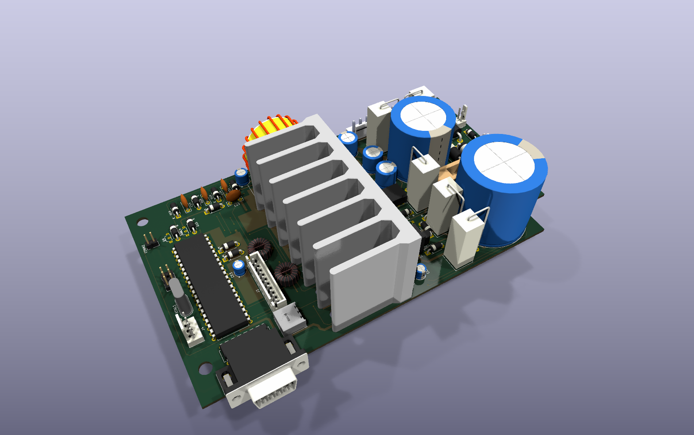
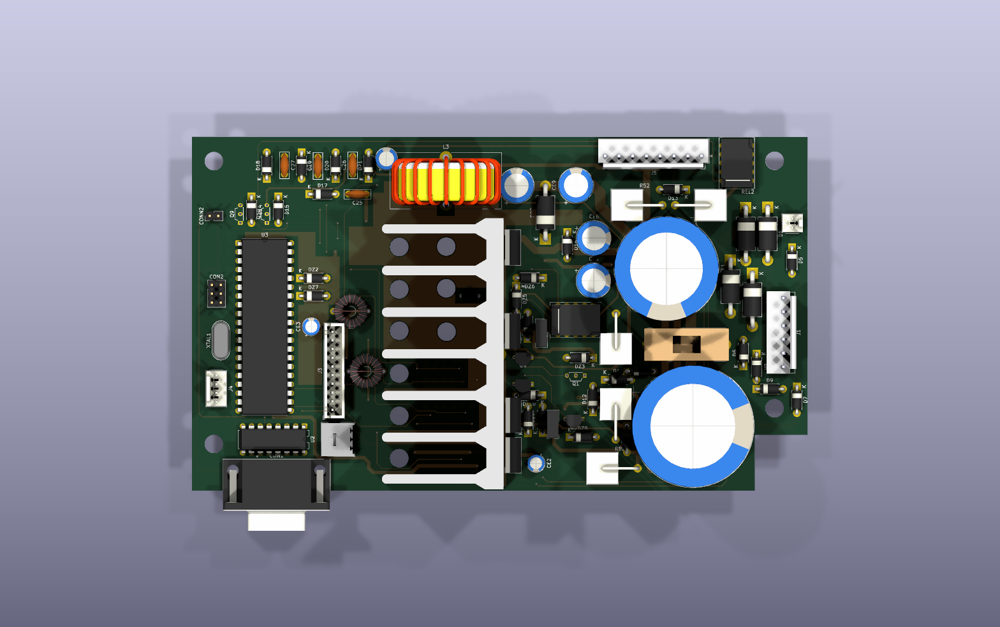
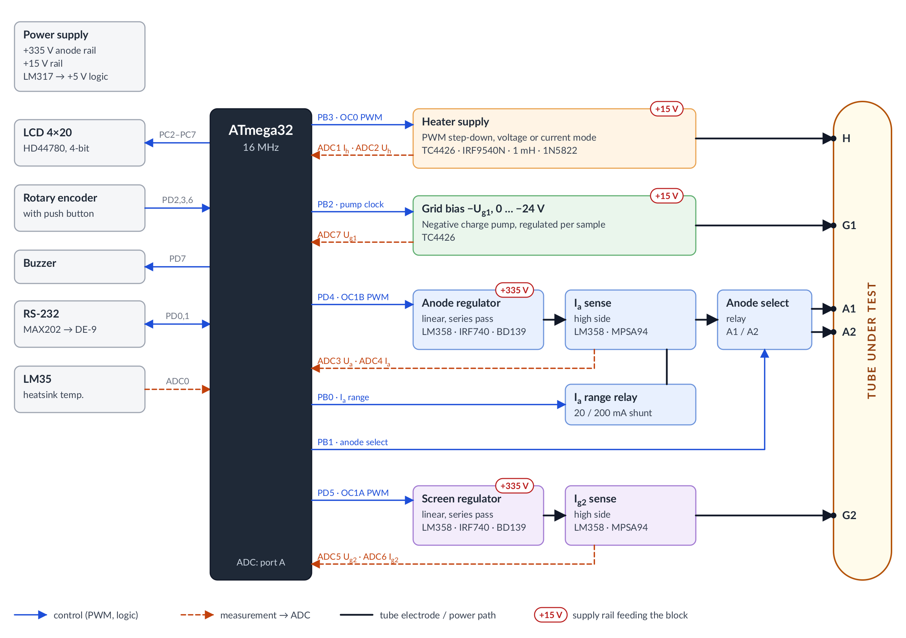
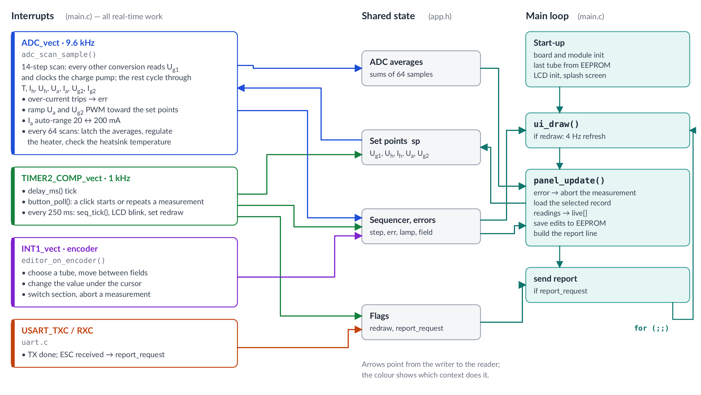
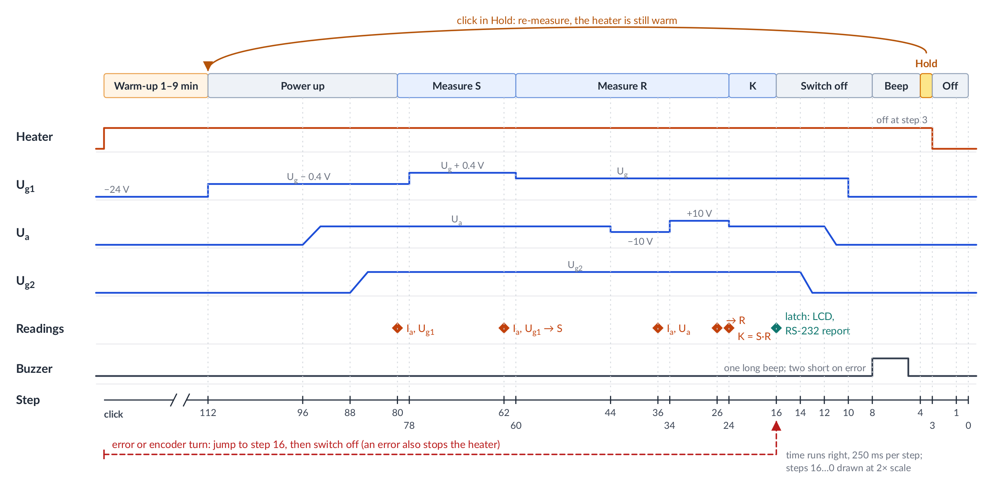

# lamptest

[](https://github.com/radiolok/lamptest/actions/workflows/build.yml)

A modern MCU-based tester for vacuum tubes.

This repository is based on the Polish **AVT5229** vacuum tube tester
("Miernik lamp elektronowych", firmware "VTTester 1.16"). It contains:

* the AVR firmware, ported from the original ICCAVR sources to avr-gcc
* a KiCad 9 redraw of the schematic and PCB, with 3D models
* the original magazine article ([`AVT5229.pdf`](docs/AVT5229.pdf), in Polish) and its [English translation](docs/AVT5229_en.md)



| Top view | Schematic |
|---|---|
|  | [](docs/images/schematic.svg) |

## Repository layout

```
firmware/             AVR firmware (C, avr-gcc)
  tests/              host unit tests, with fakes for the hardware
  avt5529.cproj       Atmel Studio 7 project
hardware/             KiCad 9 project: avt.kicad_sch, avt.kicad_pcb
  3d/                 STEP models referenced by the PCB
docs/
  AVT5229.pdf         original article (Polish)
  AVT5229_en.md       English translation
  images/             photos, article figures, PCB renders and diagrams
  diagrams/           diagram sources (make_diagrams.py)
cmake/                avr-gcc toolchain file
```

The PCB refers to the models in `hardware/3d/` as `${KIPRJMOD}/3d/...`, so the
project opens with its 3D view intact from any location. The README diagrams
are drawn by [`docs/diagrams/make_diagrams.py`](docs/diagrams/make_diagrams.py).
After editing it, run `python3 docs/diagrams/make_diagrams.py` to regenerate the
SVGs and the PNGs (it needs `rsvg-convert`, package `librsvg2-bin`).

## What it does

The tester applies the operating voltages from a tube's datasheet. It then
measures the tube's static parameters and its small-signal parameters:

| Quantity | Range | Resolution |
|---|---|---|
| Heater voltage U<sub>h</sub> (or heater current I<sub>h</sub> for series-heated P/U tubes) | 0–15.0 V / 0–2.50 A | 0.1 V / 10 mA |
| Grid bias −U<sub>g1</sub> | 0 … −24.0 V | 0.1 V |
| Anode voltage U<sub>a</sub> | 0–300 V | 1 V |
| Anode current I<sub>a</sub> (auto-range 20 / 200 mA) | 0–200.0 mA | 0.01 / 0.1 mA |
| Screen voltage U<sub>g2</sub> | 0–300 V | 1 V |
| Screen current I<sub>g2</sub> | 0–40.00 mA | 0.01 mA |
| Transconductance S = ΔI<sub>a</sub>/ΔU<sub>g1</sub> | 0–99.9 mA/V | 0.1 |
| Internal resistance R = ΔU<sub>a</sub>/ΔI<sub>a</sub> | 0–99.9 kΩ | 0.1 |
| Amplification factor K = S·R | 0–99.9 | 0.1 |

### Measurement sequence

The sequence runs in 250 ms ticks, driven by `TIMER2_COMP_vect`:

1. Switch on the heater, then wait out the warm-up time (1–9 min, set per tube).
2. Make U<sub>g1</sub> slightly more negative than U<sub>g</sub> (11 ADC steps, about 0.4 V), then ramp up U<sub>a</sub> and U<sub>g2</sub>. Read I<sub>a</sub> and U<sub>g1</sub>.
3. Make U<sub>g1</sub> the same amount less negative than U<sub>g</sub>, and read I<sub>a</sub> and U<sub>g1</sub> again. This gives **S**.
4. Return U<sub>g1</sub> to U<sub>g</sub>. Read I<sub>a</sub> at U<sub>a</sub> − 10 V and at U<sub>a</sub> + 10 V. This gives **R**, and **K** = S·R.
5. Latch the results on the LCD and send them over RS-232.
6. Ramp down U<sub>g2</sub>, U<sub>a</sub> and U<sub>g1</sub>, beep, and switch off the heater.

Press the knob to start a measurement. While the results are on screen, press it
again to re-measure without waiting for warm-up. Turn the knob to abort a
measurement or leave the results screen, which switches off the heater.

### Protections

* **Heater overcurrent**: the heater is switched off (`H` on the LCD).
* **Anode overcurrent** on the 200 mA range: U<sub>a</sub> and U<sub>g2</sub> are switched off (`A`).
* **Screen overcurrent**: U<sub>g2</sub> is switched off (`G`).
* **Heatsink over-temperature** (LM35 sensor): trips above 80 °C, clears below 70 °C (`T`).
* Any error aborts the measurement and sounds the buzzer.
* The watchdog timeout is about 1 s.

## Hardware

* **MCU**: ATmega32 with a 16 MHz crystal. The schematic symbol is the pin-compatible ATmega16A-P.
* **Display**: 4×20 HD44780 LCD in 4-bit mode.
* **Input**: rotary encoder with a push button, and a buzzer.
* **Heater supply**: a PWM step-down converter from the +15 V rail (OC0 → TC4426 → IRF9540N, 1 mH inductor, 1N5822). It runs in voltage mode, or in current mode for series-heater tubes.
* **U<sub>a</sub> and U<sub>g2</sub>**: two linear series regulators fed from a +335 V rail. A filtered PWM signal (OC1B, OC1A) sets the voltage, an LM358 drives an IRF740 pass transistor, and a BD139 limits the current. Their currents are measured on the high side with an LM358 and an MPSA94.
* **U<sub>g1</sub>**: negative bias from a charge pump, clocked by the MCU (`CKUG1`) through a TC4426. It is regulated sample-by-sample in the ADC ISR.
* **Relays**: one relay switches between anode sections (A1/A2). Another switches the I<sub>a</sub> shunt (20/200 mA).
* **Power**: a +15 V rail with a 10 000 µF reservoir capacitor, and an LM317 that makes +5 V for the logic.
* **Interface**: RS-232 through a MAX202, 9600 8N1.

### Block diagram



Blue arrows are control signals from the MCU, labelled with their pins. Dashed
orange arrows are the analog measurements that go to the ADC (port A). The red
tags show which supply rail feeds each block.

### MCU pinout

| Port | 7 | 6 | 5 | 4 | 3 | 2 | 1 | 0 |
|---|---|---|---|---|---|---|---|---|
| **A** (ADC) | U<sub>g1</sub> | I<sub>g2</sub> | U<sub>g2</sub> | I<sub>a</sub> | U<sub>a</sub> | U<sub>h</sub> | I<sub>h</sub> | Temp (LM35) |
| **B** | SCK | MISO | MOSI | K1 | U<sub>h</sub> PWM (OC0) | U<sub>g1</sub> pump clock | Anode select | I<sub>a</sub> range |
| **C** | LCD D7 | LCD D6 | LCD D5 | LCD D4 | LCD E | LCD RS | SDA | SCL |
| **D** | Buzzer (OC2) | Encoder DIR | U<sub>g2</sub> PWM (OC1A) | U<sub>a</sub> PWM (OC1B) | Encoder CLK (INT1) | Encoder button | TXD | RXD |

## Firmware structure

The firmware lives in [`firmware/`](firmware). The logic modules do not touch
the hardware. They reach the outputs through [`hal.h`](firmware/hal.h), which
is inline register code on the AVR and a fake in the host tests.

| File | Contents |
|---|---|
| [`main.c`](firmware/main.c) | Start-up, the main loop and the interrupt vectors, which only call into the modules |
| [`adc_scan.c`](firmware/adc_scan.c) | The 14-step ADC scan: averaging, the U<sub>g1</sub> charge pump, the over-current trips, the U<sub>a</sub>/U<sub>g2</sub> ramps, I<sub>a</sub> auto-range, heater regulation and the over-temperature check |
| [`control.c`](firmware/control.c) | Pure control laws used by the scan: ramp, trip filter, range hysteresis and the heater regulator |
| [`sequencer.c`](firmware/sequencer.c) | The measurement sequence, with named step points, and the S/R/K calculation |
| [`button.c`](firmware/button.c) | Push button debounce: click, held and released |
| [`editor.c`](firmware/editor.c) | Encoder handling: moving the cursor, changing values, switching sections and aborting |
| [`panel.c`](firmware/panel.c) | Main loop work: loads the selected record, converts the readings, saves edits and renders the report line |
| [`ui.c`](firmware/ui.c), [`lcd.c`](firmware/lcd.c) | LCD screens, and the HD44780 driver in 4-bit mode with field blinking |
| [`uart.c`](firmware/uart.c) | Serial output, and the `ESC` request |
| [`convert.c`](firmware/convert.c), [`format.c`](firmware/format.c) | ADC to physical units, S/R/K arithmetic and fixed-point formatting |
| [`lamp.c`](firmware/lamp.c), [`lampdb.c`](firmware/lampdb.c) | The `lamp_t` record and its editable fields; the flash tube table, the EEPROM user table and the last selected slot |
| [`app.c`](firmware/app.c) | State shared between the main loop and the interrupts: set points, errors, the selected tube and the live readings |
| [`config.h`](firmware/config.h), [`board.h`](firmware/board.h) | Thresholds and timing constants; pin assignment and the inline hardware access |
| [`tests/`](firmware/tests) | Host unit tests |

The interrupts do all the real-time work. The main loop only converts the
averaged readings, refreshes the LCD, saves edits to EEPROM and sends reports.



### Measurement sequencer

The sequencer counts down in 250 ms steps. Each action runs at a named
point (`enum seq_point` in [`sequencer.h`](firmware/sequencer.h)). The
diagram shows the outputs and readings against the step number:



## Tube database

**Flash (81 entries, read-only).** Slot `00` is a **bench power supply** mode,
where every voltage can be set by hand. Slot `01` is reserved. Slots `02`–`80`
are preset tubes, with each triode section of a twin triode stored as its own
entry:

ECC81, ECC82, ECC83, ECC85, ECC88, ECC91, ECC99, ECC35, ECC40, ECC801, ECC802, ECC803, ECC832,
E180CC, E182CC, PCC84, PCC85, PCC88, 6N1P, 6N2P, 6N3P, 6N6P, 6N30P, 6N5S, 6N7S, 6SL7, 6SN7, 6SC7,
6AS7, 6S19P, 6S2S, EF86, 6SJ7, EL34, EL84, EL90, EL95, 6V6S, 6F6S, 6L6G, 6P1P, KT66, KT77, KT88,
ECL82, ECL86, PCL86.

**EEPROM (19 entries, slots 81–99, user-editable).** You can edit every field
with the encoder: name, socket, electrode system, warm-up time, every voltage
and current, and the reference values for S, R and K.

Each name has 9 characters: `TTTTTT` `s` `e` `m`.

* `TTTTTT` is the tube type.
* `s` is the socket/adapter letter, A–J.
* `e` is the electrode system: `0` for a single tube, `1` or `2` for a section of a twin tube.
* `m` is the heater warm-up time in minutes.

For example, `ECC83_G11` means ECC83, socket G, section 1, 1 minute warm-up.

## Serial output

Press `ESC` in a terminal at 9600 8N1 to get a copy of the LCD. The tester
also sends a line automatically after every measurement:

```
Nr Type Uh[V] Ih[mA] -Ug[V] Ua[V] Ia[mA] Ug2[V] Ig2[mA] S[mA/V] R[k] K[V/V]
```

## Building the firmware

You need CMake ≥ 3.16 and the avr-gcc toolchain. On Debian or Ubuntu, install
`gcc-avr`, `binutils-avr` and `avr-libc`.

```sh
cmake -B build            # the AVR toolchain file is picked automatically
cmake --build build
```

The build writes these files to `build/firmware/`:

* `avt5229.hex`: the flash image
* `avt5229.eep`: the EEPROM image, with the user tube table
* `avt5229.elf` and `avt5229.map`

It also prints the memory usage. To treat warnings as errors, add `-DWERROR=ON`.

The Atmel Studio 7 project (`firmware/avt5529.cproj`) is still there for Windows users.

### Unit tests

The logic modules also build for the PC, with fakes for the hardware and for
`<avr/pgmspace.h>` and `<avr/eeprom.h>`. The tests run with AddressSanitizer
and UndefinedBehaviorSanitizer. You need a host C compiler and CMake:

```sh
cmake -B build-tests -DLAMPTEST_TESTS=ON
cmake --build build-tests
ctest --test-dir build-tests --output-on-failure
```

The tests cover:

* **Golden checks.** Every unit conversion, the S/R/K arithmetic and the heater
  regulator are compared, exhaustively or over millions of inputs, with
  verbatim copies of the original formulas ([`tests/legacy.h`](firmware/tests/legacy.h)).
* **ADC scan.** A simulated free-running ADC checks the channel order,
  the averaging, the U<sub>g1</sub> pump, the trips, the ramps, auto-range and over-temperature.
* **Sequencer.** A full measurement on a model triode checks the step order,
  the S/R/K results, the beeps, hold, re-measure, abort and errors.
* **User interface.** The button debounce, cursor movement and value limits,
  section switching, EEPROM saves, power-supply mode, and the exact report line.
* **Tube database.** Every record is valid, and every twin-tube section 1 is
  followed by its section 2.

GitHub Actions builds the firmware and runs the unit tests on every push and
pull request ([.github/workflows/build.yml](.github/workflows/build.yml)).
The `.hex`, `.eep`, `.elf` and `.map` files are uploaded as build artifacts.

Ready-made firmware is on the [Releases](https://github.com/radiolok/lamptest/releases) page:

* **`latest`**: a pre-release rebuilt from every push to `master`
  ([`avt5229.hex`](https://github.com/radiolok/lamptest/releases/download/latest/avt5229.hex),
  [`avt5229.eep`](https://github.com/radiolok/lamptest/releases/download/latest/avt5229.eep)).
* **`v*`**: a permanent release for every version tag, e.g. `git tag v1.0 && git push origin v1.0`.

### Flashing

The fuse values are listed in `board.h`:

* **Low fuse 0xEF**: external crystal, BOD off.
* **High fuse 0xC9**: JTAG off, which is required because PORTC drives the LCD. SPI programming stays on, and CKOPT is set.

```sh
avrdude -c usbasp -p m32 -U lfuse:w:0xEF:m -U hfuse:w:0xC9:m
avrdude -c usbasp -p m32 -U flash:w:build/firmware/avt5229.hex:i \
                         -U eeprom:w:build/firmware/avt5229.eep:i
```

> **Note:** writing `.eep` replaces your user-defined tubes (slots 81–99) with
> the defaults.

## Firmware fixes in this port

These bugs were found and fixed while bringing the avr-gcc port up:

| Problem | Effect | Fix |
|---|---|---|
| `tick_1ms` and `uart_busy`, which are set from ISRs, were not `volatile` | `-Os` turned `delay()` and `char2rs()` into endless loops. The firmware hung after start-up and the watchdog reset it about once a second. The compiler had even dropped the rest of `main()` as unreachable. | Make the ISR-shared flags `volatile` |
| `eeprom_read_block()` had its arguments swapped, copied from the ICCAVR call order | Selecting a user tube (slot ≥ 81) copied EEPROM data over the CPU registers and I/O space | Fix the argument order |
| `eeprom_write_word()` was used on 1-byte fields (name, U<sub>g1</sub>, U<sub>h</sub>, I<sub>h</sub>) | Editing one field zeroed the next one. For example, saving U<sub>g1</sub> cleared the low byte of U<sub>a</sub>, and saving the warm-up time cleared U<sub>h</sub>. | Use `eeprom_write_byte()` |
| `poptyp` (the last selected tube) was a RAM variable, but it was accessed with the EEPROM API | Every measurement wrote to the EEPROM address equal to its RAM address, which corrupted user tube slot 86 | Store it in the EEPROM byte right after the user table, which keeps the table layout. Add a range check and use `eeprom_update_byte()`. |
| The refactored `fp2ascii()` never advanced past the `'.'`, and it blanked *every* `0` in the integer part | Displayed values were wrong (`12.6` → `126`, `100` → `1  `) and the LCD fields were misaligned | Rewrite it to match the original formatting, and check it on the host |
| `temp_str[]` was defined in a header; prototypes were missing | Link error with `-fno-common` (GCC ≥ 10) and implicit-declaration warnings | Move it into `fp2ascii()` and add the prototypes |

### Refactoring

The original single 1500-line source was split into the modules listed in
[Firmware structure](#firmware-structure), and all comments were translated
into English. The behaviour is unchanged, except for these fixes:

| Change | Why |
|---|---|
| The sequencer step, the warm-up time, the ADC averages and the power-supply set points are read and written with interrupts blocked | A 16-bit value shared with an interrupt could be torn |
| S is reported as 99.9 when ΔU<sub>g</sub> = 0 | It was a division by zero |
| The LCD enable pulse lasts 8 cycles (500 ns) | `RJMP .+2` skipped every other delay, which made the pulse about 310 ns, under the HD44780 minimum of 450 ns |
| EEPROM edits use `eeprom_update_*()` | Saving an unchanged value no longer wears the EEPROM |
| The last selected slot is a member of the EEPROM layout, with a default of 0 | Its address no longer depends on a cast. The `.eep` image is one byte longer, and the user table is byte-identical. |
| The two lookup tables are stored in flash | Saves 150 bytes of RAM. The firmware now uses 10.1 kB of flash (was 12.5 kB) and 514 bytes of RAM (was 550). |

### Known limitations (not changed)

* S and R use unsigned differences. If noise makes I<sub>a</sub> go the wrong way between the two readings, the result wraps around and shows as nonsense.
* Power-supply mode shows `* OVERHEAT Warning *` on the last line, as in the original firmware.

## Links

* AVT5229 kit (PCB + programmed MCU): <https://sklep.avt.pl/miernik-lamp-elektronowych-plytka-drukowana-i-zaprogramowany-uklad.html>

## License

MIT. See [LICENSE](LICENSE). The original AVT5229 design and firmware belong to their authors and AVT.
