# AVT-5229 — Vacuum Tube Tester (TTester_LCD)

> English translation of the article *"Miernik lamp elektronowych"* (parts 1 and 2), published in
> **Elektronika Praktyczna** 4/2010 (pp. 32–35) and 5/2010 (pp. 39–43), followed by the full
> user manual from the EP 5/2010 CD.
> Authors: **Tomasz Gumny, EP** (tomasz.gumny@ep.com.pl) and **Adam Tatuś** (atatus@poczta.onet.pl).
> Source: [AVT5229.pdf](AVT5229.pdf). Figure numbering follows the original.

---

## Contents

- [Part 1](#part-1)
  - [Vacuum tube parameters](#vacuum-tube-parameters)
  - [Tester specifications](#tester-specifications)
  - [Tester design](#tester-design)
- [Part 2](#part-2)
  - [Assembly](#assembly)
  - [Mounting and wiring the test sockets](#mounting-and-wiring-the-test-sockets)
  - [Firmware](#firmware)
  - [Bring-up](#bring-up)
  - [Parts list](#parts-list)
  - [Operating instructions (summary)](#operating-instructions-summary)
- [User manual (from the CD)](#user-manual-from-the-cd)
  - [LCD layout](#lcd-layout)
  - [Fixed tube catalog (02–80)](#fixed-tube-catalog-0280)
  - [User-defined tube catalog (81–99)](#user-defined-tube-catalog-8199)
  - [Adapters for unusual tubes](#adapters-for-unusual-tubes)

---

# Part 1

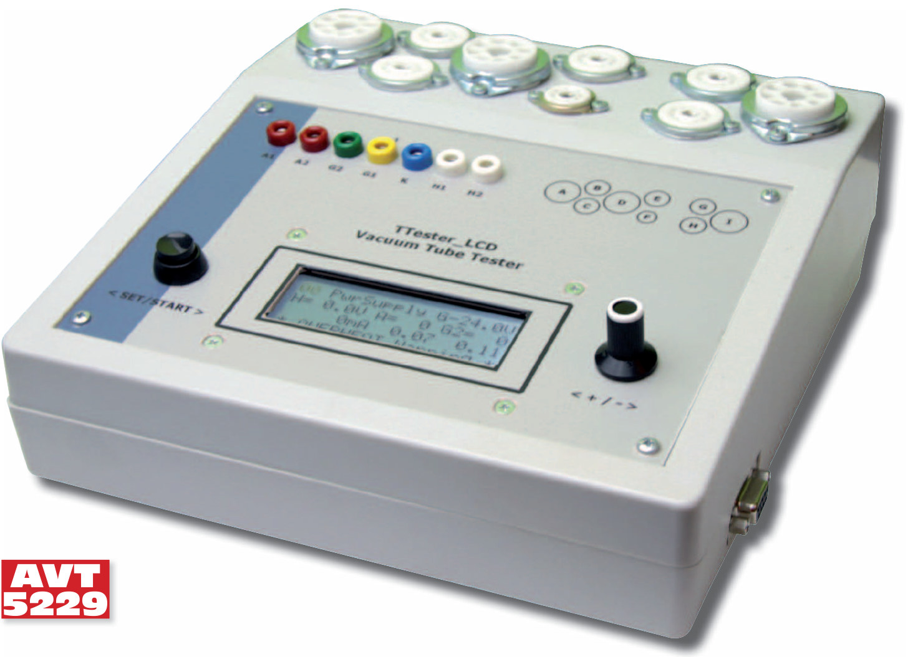

*Tube amplifiers have been enjoying a renaissance for over a decade. Unfortunately, tube quality
varies, especially for tubes that have been sitting on shelves for many years. The tester presented
here not only lets you check tubes, it is also an interesting combination of microcontroller
technology and relatively high voltages.*

| **AVT-5229 in the AVT offer** | |
|---|---|
| AVT-5229A | printed circuit board |

**Key features**

- Measures tubes at typical and non-typical operating points
- Built-in catalog with data for 100 of the most popular tubes
- Can be used as independent power supplies (heater, anode)
- Measures all relevant voltages and currents on the electrodes of the tube under test
- Automatic measurement of basic parameters with calculation of derived parameters: transconductance
  S [mA/V], voltage gain K [V/V], and internal (plate) resistance at the operating point R [kΩ]
- Data shown on an LCD
- Measurement results sent to a PC over RS-232

**Additional materials on CD and FTP** (ftp://ep.com.pl, user: 16489, pass: 1xh8b8t1):
PCB layouts; datasheets and application notes for parts marked red in the parts list.

**Related projects on CD and FTP:** AVT-1512 *Pocket NIXIE tube tester* (EP 1/2009);
*Instrument for testing vacuum tubes* (EP 10/2005).

---

For several years, electronic designs based on vacuum tubes — tube audio circuits in particular —
have been enjoying a second youth. The key element of such a circuit is the tube itself, whose
parameters directly determine the quality of the device being built. The best solution is to use
unused tubes from old production, commonly called "NOS" (new old stock). Unfortunately, we are
often forced to use second-hand or newly manufactured tubes. After many years of service, tubes
suffer from reduced cathode emission, degraded or lost vacuum, cathode poisoning and many other
problems. On the other hand, companies that have resumed tube production do not yet have enough
experience, or cannot maintain the strict process discipline, so their products rarely reach the
parameters listed in the old catalogs. All this makes measuring tube parameters more important
today than it was when tubes were commonly available.

Apart from a few expensive exceptions, tube testers are no longer made, and access to old
instruments is very limited. This is confirmed by the prices fetched by Polish-made testers such as
the P-507 (Photo 1) and P-508, or the Czechoslovak BM-215A (Photo 2). Even if you manage to obtain
such an instrument with the necessary set of cards, reliable results can only be obtained from these
decades-old instruments after a thorough overhaul and calibration.

| 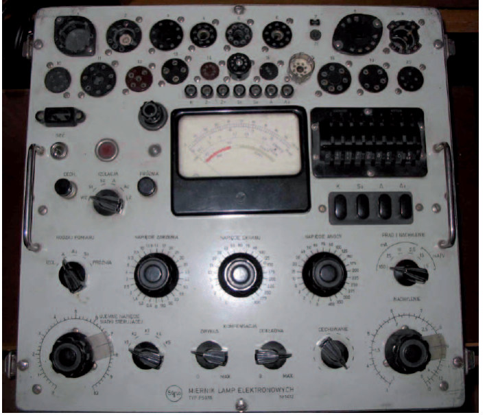 | 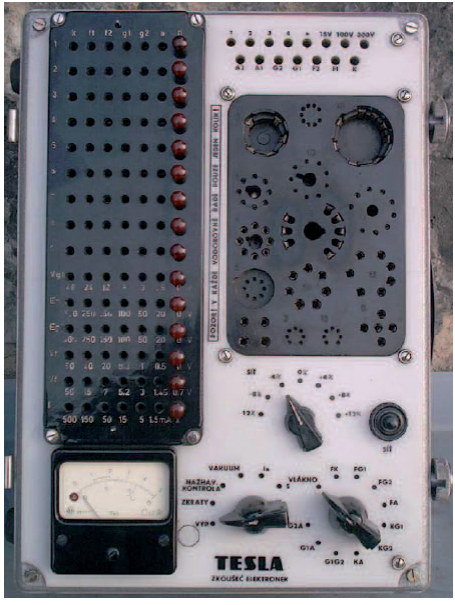 |
|:---:|:---:|
| **Photo 1.** P507 tube tester | **Photo 2.** BM-215 tube tester |

The biggest problems, however, arise when you actually try to take measurements with such old
equipment. Hundreds of cards with settings for dozens of switches and potentiometers can easily
discourage a modern tube enthusiast, and this way of operating is completely out of step with the
21st century.

The functional model for the new design was the BM-215A tube tester. It could measure tube emission
and transconductance. Operating it consisted of choosing the tube's measurement card from the
tester's catalog, placing it on a special measurement field, "programming" the power supplies and
the meter range from the markings on the card, and taking measurements by selecting the appropriate
positions of the measurement switch. The main drawbacks of that tester were the lack of regulation
of the tube supply voltages and the inability to set supply voltages continuously, which often
forced measurements at an operating point different from the catalog one. An additional "bonus" was
its size — 230×240×340 mm — and weight of 15 kg!

All this led to the idea, born on the forum of tube and vintage-radio enthusiasts "Trioda"
(www.trioda.com/forum), of developing a modern vacuum tube tester. The design focused on simple
operation, low cost and maximum versatility.

## Vacuum tube parameters

Today the range of available tubes is much smaller than in the "golden age" of tubes in the 1950s
and 60s. Tubes are mainly used to restore old radios and TV sets. Newly built equipment tends to use
either currently manufactured tubes or the NOS tubes mentioned above. The latter in particular have
a well-deserved good reputation thanks to their high build quality and affordable price.

Audio equipment most often uses low-power double triodes of the ECC81/82/83/88 series and their
Soviet functional equivalents 6N1/2/23P, 6H8/9S; power pentodes of the EL34/84, 6L6/6V6, KT66/88
series; and, somewhat less often, small-signal pentodes such as the EF86 and 6SJ7.

The basic parameter that must be determined to assess tube quality is the **anode current Ia [mA]**.
This is the current flowing into the anode at the voltages specified by the tube manufacturer — Ua,
Ug2, Ug1 — with nominal heating Uh/Ih. The measured value is compared with the manufacturer's data.
A significant drop in anode current relative to the nominal value indicates degraded cathode
emission. Conversely, too high a value may indicate a loss of vacuum. The anode current is measured
directly, with no additional calculation.

**Transconductance S [mA/V]** (slope of the characteristic) is especially important when matching
tubes into pairs and quads that will run in parallel or push-pull. S is calculated from measurements
at two points near the operating point. After switching on the heater and waiting a few minutes,
the first-grid voltage Ug1 is set to the catalog value. Then the anode voltage Ua is set to the
catalog value and the anode current Ia(1) is measured. Next, the first-grid voltage is increased by
1 V and the anode current Ia(2) is measured again. Substituting into the formula:

$$S\,(U_a = \text{const}) = \frac{I_a(2) - I_a(1)}{\Delta U_{g1}} \quad \left[\frac{\text{mA}}{\text{V}}\right]$$

gives the transconductance.

In old testers, the first-grid voltage Ug1 was usually first set to the nominal value and then an
extra switch added 1 V, which avoided division (ΔUg1 = 1). This tester uses the nominal voltage
reduced and increased by 0.4 V. A measurement done this way gives the transconductance exactly at the
point recommended by the manufacturer, and the smaller ΔUg1 is safer for tubes operating at low Ug1,
e.g. the ECC81.

Determining the **internal resistance R [kΩ]** also requires measurements at two points. At the
catalog values of Ug1 and Ua we measure Ia(1). Then we increase the anode voltage Ua by 10 V and
measure Ia(2) again. Substituting into:

$$R\,(U_{g1} = \text{const}) = \frac{\Delta U_a}{I_a(2) - I_a(1)} \quad [\text{k}\Omega]$$

gives the internal resistance.

The **voltage gain K [V/V]** (amplification factor μ) is obtained purely by calculation:
**K = R × S**, where R and S are the internal resistance and transconductance determined by the
previous measurements.

## Tester specifications

The tester's specifications are a compromise between price and the number of tubes that can be
tested. Based on an analysis of the parameters of tubes currently available and commonly used, the
following voltage and current ranges were chosen for the power supplies:

- heater: 0…15 V / 2.5 A (briefly up to 3 A),
- first grid: 0…–24 V / 2 mA,
- second grid: 0…300 V / 40 mA,
- anode: 0…300 V / 200 mA; to improve accuracy, current is measured in two sub-ranges,
  20 mA / 200 mA.

## Tester design

The block diagram of the tester is shown in Fig. 3 and the schematic in Fig. 4. It consists of seven
blocks:

- heater supply (H),
- first-grid supply (G1),
- anode supply (A),
- second-grid supply (G2),
- control block (UC) with LCD, encoder, push-button and RS-232C,
- power block (PWR),
- test-socket block (TUB).

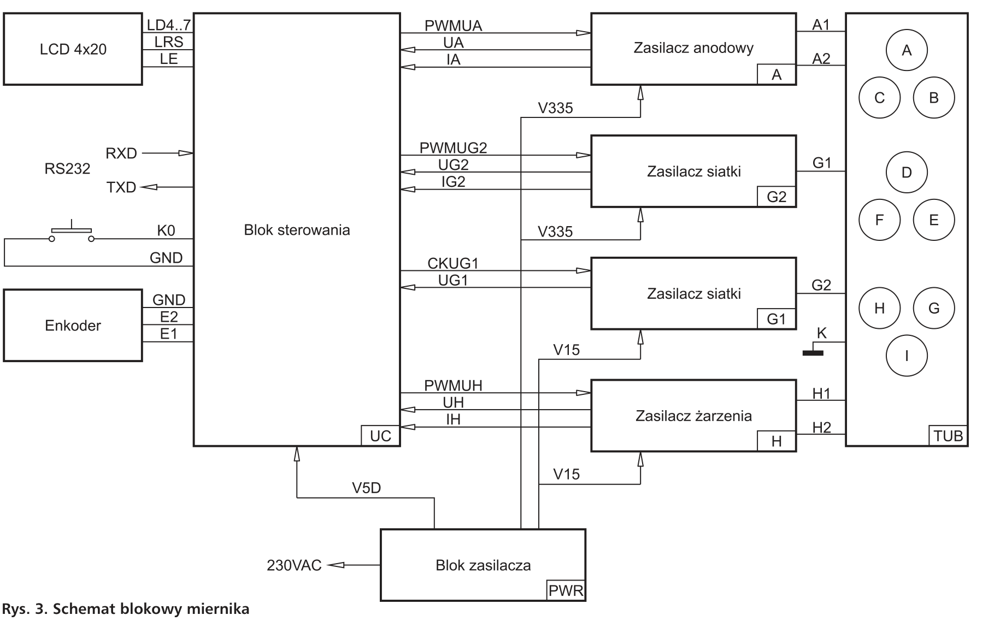

**Fig. 3.** Block diagram of the tester. *(Labels: Blok sterowania = control block; Zasilacz
anodowy = anode supply; Zasilacz siatki = grid supply; Zasilacz żarzenia = heater supply; Blok
zasilacza = power supply block; Enkoder = encoder.)*

The heart of the tester is an ATmega16 single-chip microcontroller. The firmware sets the reference
voltages for the anode (A) and second-grid (G2) supplies, while the heater (H) and first-grid (G1)
supplies are implemented in software. In addition, the processor uses its built-in ADC to measure
the voltages Uh, Ug1, Ua and Ug2 and the currents Ih, Ia and Ig2, and if any maximum is exceeded it
performs an emergency shutdown with an alarm indication. At the end of a measurement cycle, the
processor computes the remaining parameters, shows the full set of results on the built-in LCD and
sends them over the serial port.

The microcontroller's memory holds a database of parameters for the 100 most common vacuum tubes.

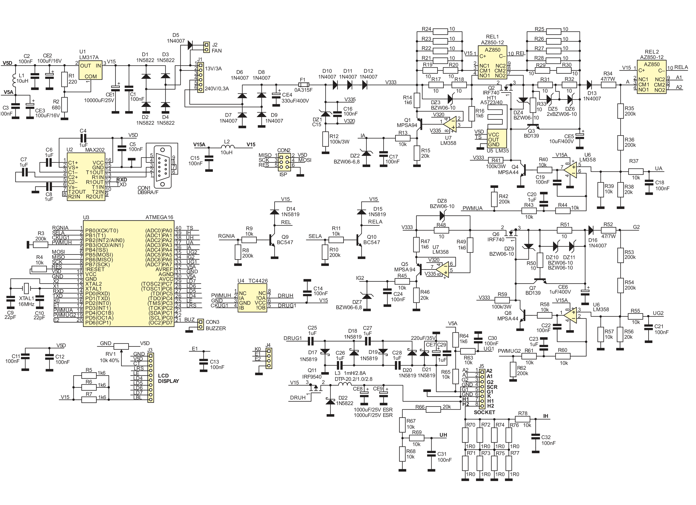

**Fig. 4.** Schematic diagram of the tester (rotated to landscape for readability; the original
portrait page is in [images/rys4_schematic.png](images/rys4_schematic.png)).

### Heater supply

The heater supply provides the voltage for the cathode heater of the tube under test. The tester
can only measure indirectly heated tubes, i.e. those whose heater is electrically isolated from the
cathode. This is not much of a limitation, since apart from rectifier diodes, directly heated tubes
are rarely used today.

Depending on the type of tube being measured, the heater supply can operate in voltage-regulation
mode, e.g. for E-series tubes, or current-regulation mode, e.g. for P-series tubes.

The heater supply must deliver substantial current over a wide range of output voltages. To limit
power losses, a switching supply was chosen: a variable-duty-cycle step-down **buck converter**. For
high efficiency, the switching element is a low-on-resistance IRF9540 MOSFET (Q11)
(R<sub>DS(on)</sub> = 0.2 Ω). The transistor's gate is driven by a TC4426 buffer (U4), which charges
and discharges the input capacitance very quickly. The energy-storage element is a 1 mH / 2.6 A
inductor (L3). Capacitors CE8 and CE9 filter the output voltage. Because of the switching operation,
and to ensure long capacitor life, components with the lowest possible equivalent series resistance
(ESR) must be used.

The heater converter is controlled in software, making maximum use of the microcontroller's
hardware resources. The PWMUH waveform that drives the switching transistor is generated by an
internal counter of the microcontroller and is available on output OC0 (pin 4 of U4). The timer is
clocked at 16 MHz. With 256 possible duty-cycle steps, this gives a frequency of 62.5 kHz. A PWM
waveform at this frequency causes no audible effects in the inductor and allows an inductor of
"reasonable" size. An inductance of 1 mH keeps the buck converter in continuous-conduction mode over
the full output-voltage range at loads as low as about 40 mA.

The heater converter is fed from an unregulated voltage of about 15 V. This voltage (V15) is taken
from capacitor CE1, charged from a full-wave rectifier made of diodes D1…D4. With this supply
voltage and 8-bit PWM resolution, the heater voltage can be set in steps of about 60 mV. The heater
current is measured indirectly by measuring the voltage drop across a shunt made of resistors
R70…R77. The voltage across these resistors, after filtering by R78/C32, is fed to the processor's
ADC1 input. The converter output voltage is divided by R68/(R66+R67) and, after filtering by
R69/C31, fed to the processor's ADC2 input. The actual voltage applied to the tube heater equals the
converter output voltage minus the drop across the current-sense shunt; the firmware applies this
correction continuously.

The heater supply can operate in voltage- or current-regulation mode. In both cases, the control
loop is implemented in software. In voltage-regulation mode, the program tries to keep the heater
voltage at the value set by the user. The cathode heaters of higher-power tubes have a relatively
low cold-filament resistance and a large thermal inertia. Therefore, after the heater is switched
on, the voltage ramps up linearly at about 0.6 V/s. In current-regulation mode, the current likewise
ramps up linearly to the set value, after which the program tries to maintain the set heater current
regardless of the load resistance.

The control program switches the converter off if the output current exceeds 3.8 A. Such a shutdown
is signalled by a beep and an indicator on the LCD. The heaters of some tubes, e.g. the popular
6N13S triode, can draw more than 3.5 A during the first seconds, with a nominal heater current of
2.5 A. If, on first power-up, such a tube's heater trips the overcurrent protection, try again.
Usually by the second or third attempt the heater is warm enough not to overload the converter.

A relatively large current flows through the heater pins, so contact problems in the sockets tend
to occur there. In current-regulation mode, disconnecting the load normally causes the output
voltage to rise to its maximum. If the connection is then restored, e.g. by wiggling the tube in its
socket, the heater will burn out instantly. Therefore, in current-regulation mode, the processor
does not change the PWM duty cycle if the output current falls below 5 mA, which indicates that the
load has been disconnected.

Note, however, that the output capacitors of a switching converter running without a load will
charge up to a dozen or so volts. For this reason, avoid connecting or disconnecting a tube heater
while the heater voltage/current settings are non-zero or while the tester shows voltage present on
the H1/H2 terminals.

### First-grid supply Ug1

The first grid needs a negative potential relative to the cathode. In this tester the tube cathode
is always connected to instrument ground, so a negative voltage, precisely adjustable from 0 to
–24 V, had to be generated.

The current drawn by the first grid is negligible and, for a healthy tube, does not exceed a dozen
or so microamperes. This made it possible to do without an extra winding on the mains transformer
and to build the Ug1 supply as a polarity-inverting voltage multiplier. The pulse source for the
multiplier is the processor's CKUG1 output (pin 3 of U3). A fixed 5 kHz signal from the processor is
fed to one of the two inverting buffers in U4 (TC4426). At the output of U4 the pulses reach an
amplitude of about 15 V and have fast rising and falling edges. This square wave is fed to a classic
multiplier made of capacitors C25…C29 and diodes D17…D20. The output voltage is further filtered by
capacitor CE7. The first-grid voltage is a very important parameter during a tube measurement, so
particular care was taken over its stability and accuracy.

The voltage is measured using a somewhat unusual divider R64/R65 referenced to the reference
voltage. This simple trick both rescales the measured voltage and shifts it into the positive range,
so the divider output, after filtering by R63/C30, can go straight to the ADC7 input (pin 33 of U3).

The output voltage is regulated in software by "swallowing" the clock pulses that drive the
multiplier. The processor periodically reads the voltage on ADC7, converts it and compares the result
with the value set by the user. If the negative voltage exceeds the reference, the next pulse is not
output.

The biggest danger to the first-grid supply is an inter-electrode short during measurement. Even a
tube checked with an ohmmeter beforehand can short when the electrode geometry changes as the tube
warms up. If grid 1 shorts to grid 2 while measuring a pentode, or grid 1 to the anode while
measuring a triode, the full Ua or Ug2 voltage — up to 300 V — appears on the Ug1 supply output. To
protect the Ug1 supply, diode D21 clamps any positive voltage reaching the Ug1 output. The short-
circuit current is limited to a safe value by anti-parasitic resistors of about 10 kΩ mounted
directly at the tube sockets.

### Anode supply Ua

The source for the anode and second-grid supplies is a mains-transformer secondary rated at
240 VAC. After rectification in the bridge D6…D9 and smoothing by capacitor CE4 we get about 335 V
(line V335). A shunt regulator made of Zener diode DZ1 and resistor R12 provides a potential 15 V
lower (line V320), which powers op-amps U7A/B (LM358). The current-measurement circuits are built
around these parts.

LM358 op-amps are cheap and good enough for this application, but they require the input voltage to
be at least 1.5 V below the positive supply rail (line V333). Diodes D10…D12 provide the necessary
voltage drop. The last element shared by the anode and second-grid supplies is the L2/C15 filter.
The resulting V15A voltage powers op-amps U6A/B (LM358).

The anode supply is a linear regulator with a series MOSFET pass transistor Q2. The gate of Q2 is
pre-biased by resistor R41. High-voltage transistor Q4 lets the error amplifier (pin 7 of U6)
control the gate potential. The reference for the error amplifier is the PWMUA variable-duty-cycle
waveform, double-integrated (R43/C20 and R44/C19). The supply output voltage, divided by 61 in the
divider (R35+R36)/(R38‖R39), is fed to the non-inverting input of the error amplifier (pin 5 of U6).
The same voltage, after filtering by R37/C18, is measured by the microcontroller via the ADC3 input
(pin 37 of U3) and, after conversion, displayed on the LCD.

Measuring current in a high-potential line is always tricky, and here the voltage is adjustable
from 0 to 300 V! The solution used was inspired by the MAX471 IC: the measurement circuit is a
discrete, high-voltage implementation of half of that chip. A detailed description can be found in
the MAX471 datasheet. In short: the voltage drop across the sense shunt (R17+R18) produces a
proportional collector current in Q1. The voltage this current develops across R15 is filtered by
R13/C17 and fed to the ADC1 input (pin 39 of U3).

In this tester, the anode-current sense circuit was moved ahead of the regulator. This simplified
the power supply, allows the sense circuits of several lines to be fed from a single voltage, and
avoids problems measuring current at low output voltages.

The gate-bias circuit R41/Q4 is fed from before the shunt and does not affect the measurement. The
gate current is negligible (max 0.1 mA), so we can assume that the current flowing into the
regulator (which we measure) equals the current flowing out to the anode. Unfortunately, the current
of the output-voltage divider cannot be ignored: it is almost 0.74 mA at 300 V and, moreover,
depends linearly on the anode voltage. The processor therefore continuously subtracts the divider
current and displays on the LCD exactly the current flowing to the anode of the tube under test.

The basic measurement range is 20.00 mA. Measuring higher-power tubes required an additional
200.00 mA range. Switching range consists of connecting an additional 2.222 Ω resistance
(R19…R24) in parallel with the 20 Ω shunt (R17+R18) using relay REL1. The processor turns the relay
on when the anode current exceeds 19 mA and off when it drops below 17 mA.

Relay REL2 was added at the output of the anode supply. For tubes with a dual electrode system, its
contacts route the anode voltage to the first (A1) or second (A2) anode. This makes it possible to
measure a double tube without removing it from the socket or swapping cables.

The anode supply includes a number of measures to protect the tester's circuits from damage. The
first is fast fuse F1, shared by the anode and second-grid supplies. Next is transil DZ3, which
protects the sense-shunt resistors. Zener diode DZ4 prevents the gate-source voltage Ugs of Q2 from
exceeding its limit. Transistor Q3, with the switched shunts R31+R32 and R25…R30, limits the
short-circuit current to about 350 mA. Transils DZ5 and DZ6 protect the overcurrent-protection
shunts. Diode D13 prevents current from "flowing back" into the output, which could happen if the
tube's anode shorts to the second grid. Resistor R34 limits the short-circuit current before the
other protections kick in.

Note that transils DZ3, DZ5 and DZ6 operate unusually — in the forward direction. Various other diode
types did not work well here. Transil DZ2 operates normally, in reverse, and protects the processor
input if transistor Q1 fails.

The tester is primarily intended for measuring tubes in automatic cycles, but the option of using
its blocks as anode, grid and heater power supplies was added. In this mode the power dissipated in
the pass transistors (Q2, Q6) can overheat them. For this reason an LM35DZ temperature sensor is
mounted on the heatsink. If the heatsink exceeds a safe temperature, the tester is locked out until
it cools down.

### Second-grid supply Ug2

The adjustable second-grid supply is built the same way as the anode supply, except that its output
current is measured on a single 40.00 mA range. Independently of the hardware protections, the
control program switches off both supplies if the anode current exceeds 240 mA or the grid current
exceeds 48 mA. A tripped protection is signalled by a beep and an indicator on the LCD.

The output voltages of both supplies are set by the microcontroller, and regulation is done by error
amplifier U6. Too fast a rise of the anode voltage could trip the overcurrent protection. To avoid
disturbing the tester's operation, the program increases and decreases the reference voltages
linearly. This limits the rate of rise and fall of the supply outputs to about 180 V/s.

### Control block

The ATmega16 microcontroller is clocked from an external 16 MHz crystal. The PCB has room for a
6-pin ISP connector, which allows the initial programming and later firmware updates.

The tester's circuits are powered by the popular LM317A IC regulator (U1). Its output is also the
reference voltage for the internal ADC. Two PWM outputs (PWMUA and PWMUG2) act as DACs; their
accuracy also depends on the supply voltage, so setting this voltage accurately is important.

The LM317A output is set by resistors R1/R2 to 5.12 V. The tolerance of the resistors and of the
LM317A's internal reference causes a spread of several tens of millivolts in the output voltage.
5.09 V was the most common result, and that value is declared in the firmware; so, for maximum
accuracy, the V5D line should be set to that potential. The LM317A output powers all digital circuits
of the tester (V5D). The supply for the analog circuits (V5A) is additionally filtered by
L1/(C3+CE3).

The tester has a 4-line, 20-character alphanumeric LCD, which shows the current settings and
measurement results. The microcontroller drives the LCD via four data lines LD4…LD7 and two control
lines LE and LRS. For the display to work properly, its contrast must be set with trimmer RV1.

The tester beeps on power-up, at the end of a measurement cycle and on an emergency shutdown caused
by a protection trip. The sound source is a piezoelectric transducer connected to connector CON3.
The processor generates a 500 Hz square wave. Only sounders **without a built-in oscillator** should
be connected to CON3.

A bidirectional serial port enables communication with a computer. U2 (MAX202) with capacitors
C5…C8 performs TTL/RS-232C level conversion.

A rotary encoder is used to browse the tube catalog and to set voltages and currents. The encoder
connects to pins E1, E2 and GND of connector J4. The tester also has an extra push-button connected
to pins K0 and GND. The display layout and how to use the encoder and button are described in detail
in the user manual.

### Power block

The tester is powered from 230 VAC through an IEC inlet with a standard computer power cord. The
number of wires and terminals connected to the mains was reduced by using a combined power-entry
module: in one housing it contains the power inlet, a mains switch with a power-on lamp and a fuse
holder, sometimes with room for a spare fuse. In most such modules the fuse cannot be replaced
without unplugging the power cord. A slow-blow 800 mA fuse protects the transformer primary. For
user safety, the supply uses an isolating mains transformer. A transformerless supply running
directly from the mains would have been possible, but safety considerations prevailed. The small
enclosure required a toroidal transformer. The tube sockets and their wiring sit directly above the
transformer, so when buying the transformer make sure its diameter does not exceed 90 mm and its
height 40 mm.

The 13.3 VAC from the secondary feeds a full-wave rectifier made of Schottky diodes D1…D4. This
reduces the voltage drop and the power dissipated in the diodes at maximum heater current
(2.5…3 A). The rectified voltage is filtered by capacitors CE1 and C1. The unregulated ~15 V
(line V15) feeds the +5 V regulator (U1), the buffers (U4), the relay coils (REL1, REL2) and the LCD
backlight.

The same voltage, filtered by L2/C15, powers the op-amps (U6) in the anode and second-grid voltage
regulators (line V15A).

*Tomasz Gumny, EP — Adam Tatuś*

---

# Part 2

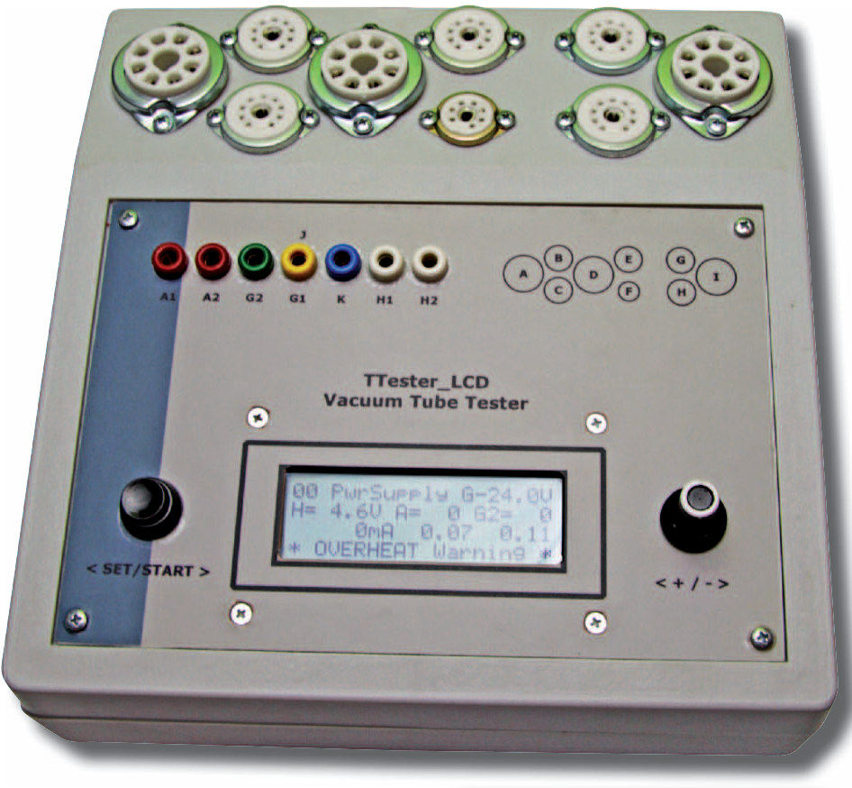

*The immediate response from readers to the first part of this article confirms that tube
amplifiers interest many electronics hobbyists. The second part describes the assembly and bring-up
procedure of the tester in detail.*

**Additional materials on CD and FTP** (ftp://ep.com.pl, user: 15257, pass: 1ajsf046): PCB layouts;
datasheets and application notes for parts marked red in the parts list.

## Assembly

Figures 5 and 6 show the tester's assembly drawings. Because SMD parts are used, assembly requires a
low-power soldering iron, preferably with tip-temperature control. Tweezers for placing and holding
parts will also be needed.

| 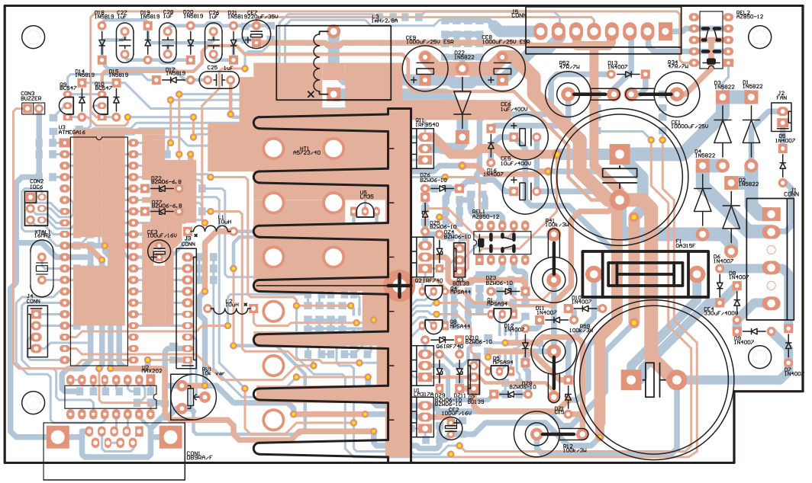 | 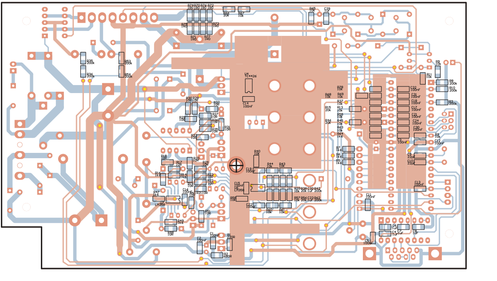 |
|:---:|:---:|
| **Fig. 5.** Component placement, top layer (shown at 50%) | **Fig. 6.** Component placement, bottom layer (shown at 50%) |

The PCB is double-sided with plated-through holes. Solder mask not only makes SMD assembly easier by
preventing solder from spreading, but also provides extra electrical insulation, which is very
useful given the high voltages on the traces.

Before you start soldering, check the board under a magnifier for shorts between traces. Finding
such defects will be much harder once assembly is complete. It is also worth wiping the solder side
with SMD flux.

First mount the SMD resistors, capacitors and ICs located on the bottom layer. When finished, check
that every lead has been soldered — with this many, it is easy to miss one. Then, on the top layer,
solder the low-profile through-hole parts: rectifier and Zener diodes, capacitors and relays. Use a
socket for the processor: once it is soldered directly into the board, replacing it without
specialist tools will be practically impossible. Connectors come next. J1 and J5 must be pressed
into the board; you can push the pins in one by one with pliers, or press the whole connector in
with a vise. When fitting the connectors, pay attention to the orientation of the keys, because they
are "polarized" and soldering one in backwards can damage the tester. Next mount the transistors,
except those screwed to the heatsink. Then the electrolytic capacitors, except CE1 and CE4, and the
converter inductor.

The power transistors Q2, Q6, Q11 and regulator U1 are mounted last. They sit on a heatsink made from
A5723 aluminium profile, 40 mm high. First mark out the positions of the mounting-screw holes. After
drilling, tap the holes with an M3 tap. After cleaning the heatsink, apply silicone thermal paste
where the parts make contact. Then attach the transistors using mica washers and insulating bushes.
Do not tighten the mounting screws yet. Attach the populated heatsink to the board with a standoff
that has internal and external threads. Once the heatsink is positioned so that the component leads
are not unnecessarily stressed, tighten all parts to the heatsink. Only now solder their leads to
the PCB. The last parts, mounted after tightening the heatsink screws, are CE1 and CE4. It is worth
adding extra mechanical support for CE1, CE4 and L3 by gluing them to the board with hot-melt glue.

## Mounting and wiring the test sockets

The tester's enclosure has room for nine sockets for tubes under test: three octal, five noval and
one heptal (7-pin miniature). The sockets are labelled "A" to "I". To allow measurement of less
common tubes, the outputs of all supplies (H1, H2, K, G1, G2, A1, A2) are also brought out to banana
jacks. This set of jacks is designated as "socket" **"J"** (Fig. 7). Table 1 lists the connections
between the supply outputs (connector J5) and the pins of tube sockets "A"…"J".

Remember that the tester produces voltages that can be lethal, so the wiring must be done with wire
of adequate insulation. The banana jacks must be of a safe design that prevents accidental contact
with the metal terminal.

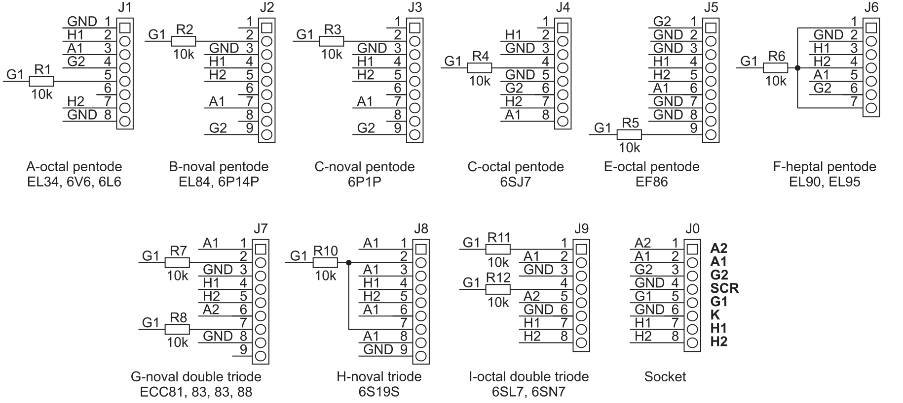

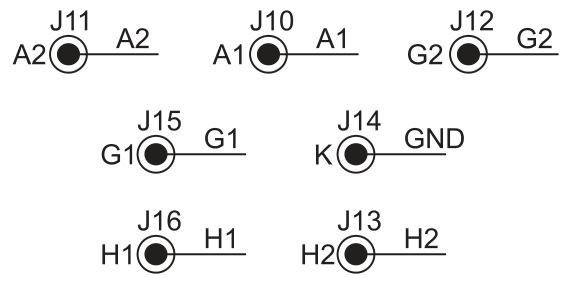

**Fig. 7.** Socket wiring diagram. *(A-octal pentode: EL34, 6V6, 6L6; B-noval pentode: EL84, 6P14P;
C-noval pentode: 6P1P; C(D)-octal pentode: 6SJ7; E-octal pentode: EF86; F-heptal pentode: EL90,
EL95; G-noval double triode: ECC81, 82, 83, 88; H-noval triode: 6S19S; I-octal double triode: 6SL7,
6SN7.)*

**Table 1.** Connection of connector J5 pins to the tube sockets (socket pin numbers)

| Socket \ J5 pin | 8 | 7 | 6 | 5\* | 3 | 1 | 2 |
|---|---|---|---|---|---|---|---|
| A | 7 | 2 | 1, 8 | 5 | 4 | – | 3 |
| B | 5 | 4 | 3 | 2 | 9 | – | 7 |
| C | 5 | 4 | 3, 8 | 7 | 2, 9 | – | 1, 6 |
| D | 7 | 2 | 3, 5 | 4 | 6 | – | 8 |
| E | 5 | 4 | 2, 3, 7, 8 | 9 | 1 | – | 6 |
| F | 4 | 3 | 2 | 1, 7 | 6 | – | 5 |
| G | 5 | 4 | 3, 8 | 2, 7 | – | 6 | 1 |
| H | 5 | 4 | 9 | 2, 7 | – | – | 1, 3, 6, 8 |
| I | 8 |  |  |  |  |  | 2 |
| **J** | **H2** | **H1** | **K** | **G1** | **G2** | **A2** | **A1** |

\*) The G1 potential must be connected through 10 kΩ anti-parasitic resistors mounted directly on
the sockets. Shielded wire is recommended; connect the shield to pin 4 of connector J5.

Photo 8 shows the arrangement of the subassemblies inside the tester. The tester fits nicely in
desk-type enclosures such as the Z-25 (Kradex), G1502 (Pro-Desk) or similar. The front panel needs
holes for the banana jacks, LCD, push-button and encoder (Figs. 9 and 10). The legends were made as
a sticker (Fig. 11).

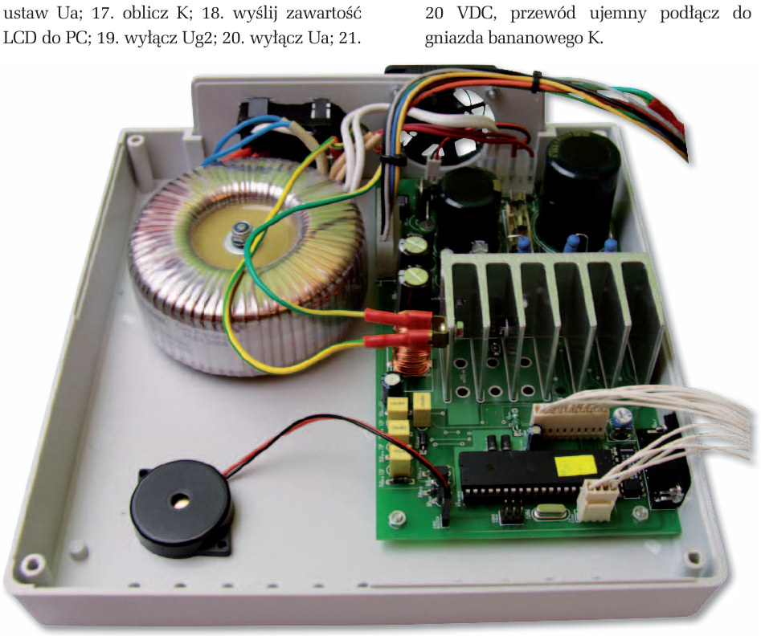

**Photo 8.** Arrangement of subassemblies in the enclosure.

Under heavy use, the tester needs forced airflow — not just around the heatsink but around the other
parts inside the enclosure too. For this purpose a hole was cut in the rear wall and a fan with a
protective grille mounted on the outside. The prototype uses a 12 VDC, 50×50×12 mm fan powered from
connector J2.

## Firmware

The tester's firmware is written in C and was developed in the ImageCraft ICCAVR IDE. In the
current version (1.14), just over 2100 bytes of Flash are taken by the tube catalog. The EEPROM is
almost entirely occupied by the user-editable part of the tube catalog.

The basic timer interrupt is generated every 1 ms. Independently of it, every 100 µs an interrupt
signals that the A/D converter has finished. Each successive interrupt selects a different channel
of the ADC input multiplexer. Calculations use the sum of 64 consecutive samples from each channel.
The exception is the channel reading the first-grid voltage: for speed, it is read alternately with
all the others: TS, UG1, IH, UG1, UH, IG1, UA, UG1, IA, UG1, UG2, UG1, IG2, UG1 and TS again.

The emergency-shutdown conditions are checked after every reading, so the overcurrent protections
(Ih, Ia, Ig2) react very quickly. The supplies are also shut down if the heatsink temperature exceeds
80 °C. Re-enabling requires the heatsink to cool below 70 °C.

Encoder pulses are handled by a hardware interrupt, so even fast turning of the knob is read
correctly. The button state is polled every 1 ms. A press longer than 20 ms and shorter than 250 ms
is treated as a "click". Holding the button for more than 250 ms changes how encoder pulses are
interpreted, which is indicated by a change in the LCD cursor's blink rhythm.

The automatic tube-measurement cycle consists of 24 steps:

1. set Uh (or Ih);
2. wait the initial heating time;
3. set Ug1 – 0.4 V;
4. set Ua;
5. set Ug2;
6. read Ia(1);
7. set Ug1 + 0.4 V;
8. read Ia(2);
9. calculate S;
10. set Ug1;
11. set Ua – 10 V;
12. read Ia(1);
13. set Ua + 10 V;
14. read Ia(2);
15. calculate R;
16. set Ua;
17. calculate K;
18. send the LCD contents to the PC;
19. switch off Ug2;
20. switch off Ua;
21. switch off Ug1 (set to –24 V);
22. sound a beep;
23. wait for the tube half (system) to be changed;
24. switch off Uh (or Ih).

Because Uh/Ih, Ua and Ug2 rise and fall gently, and the Ug1 multiplier is relatively slow, suitable
delays are inserted between steps.

## Bring-up

Before powering up, check the assembly carefully. Experience shows it is worth checking twice — even
better if someone else does it. If the assembly is correct, you can move on to the next stage.

At this stage, bring-up is done **without the processor and without high voltage**. Steps:

- Connect the 13 VAC winding to the appropriate pins of power connector J1.
- Prepare a multimeter set to the 20 VDC range; connect the negative lead to banana jack K.
- Check that everything is connected correctly.

**The following steps can be dangerous, so take care!** Switch the tester on and check the voltages
according to the list below:

- The cathode of D1, pin 6 of U4 and pin 8 of U6 should be at 16…18 V, but not more than 20 V; if
  the voltage on line V15 exceeds 20 V, U4 (TC4426) may be damaged.
- Pins 10, 30, 32 (U3), 16 (U2) and 2 (CON2) are the digital supply. The voltmeter should show
  5.12 V (–30 mV). The tester is most accurate when this voltage is 5.09 V.
- On pin 3 (J3) of the LCD connector it should be possible to set 0…5.12 V with contrast trimmer RV1.
  With the display connected, set the wiper so that the characters are visible with good contrast.
- Prepare a piece of insulated wire. Insert one end into pin 10 of the processor socket and briefly
  touch the other end to pin 1. Relay REL1 should click on.
- Touch the wire end to pin 2 of the processor socket. REL2 should click on.
- Connect the tester to a computer with a modem cable (RS-232C extension), start a terminal program
  on the PC (e.g. HyperTerminal), set 9600,8,N,1 and turn off "Echo". Bridge pins 14 and 15 of the
  U3 processor socket with a piece of wire. After pressing a few keys, the typed letters should
  appear on screen. With the jumper removed, no characters should appear.

That is essentially everything that can be checked at this stage. If all tests pass, proceed to
testing with the 240 VAC winding connected:

- Switch the tester off, unplug the power cord, and connect the 230 VAC winding to connector J1. The
  voltage on the main supply line V335 should be about 335 V; it depends strongly on the mains
  voltage and the transformer used. The voltages below are measured relative to ground (cathode
  potential), but their values depend on the voltage on line V335. So besides the absolute value,
  the difference relative to V335 is given:
  - cathode of D6 — about 335 V,
  - drain of Q2, Q6 — about 333 V (2 V below V335),
  - anode of DZ1 — about 320 V (15 V below V335).

Switch on the power and measure the voltages at the points listed. If they are all correct, switch
the tester off and wait 10 minutes for the high-voltage capacitor to discharge. The next steps need
a piece of insulated wire about 15 cm long.

- Connect one end of the wire to pin 3 (J3) and the other to pin 18 (U3); set the RV1 wiper to
  ground potential.
- Set the voltmeter to the 1 kV range and connect it to banana jack A1.
- Switch the tester on and slowly increase the voltage on the RV1 wiper. The A1 voltage should
  change from 0 V to just over 300 V.
- Switch the tester off and wait long enough for the capacitors to discharge.
- Move the jumper from pin 18 (U3) to pin 19 (U3); set the RV1 wiper to ground potential.
- Move the voltmeter lead to jack G2.
- Switch the tester on and slowly increase the voltage on the RV1 wiper. The G2 voltage should
  change from 0 V to just over 300 V.

Before you start disconnecting the measurement leads, switch the tester off and wait 10 minutes for
the electrolytic capacitors to discharge. If all tests so far have passed, you can insert the
processor into its socket and check the tester's operation in power-supply mode.

## Parts list

Parts shown in red in the original (datasheets on the CD) are marked with †.

**Resistors** (SMD, 1206)

| Ref | Value |
|---|---|
| R1 | 220 Ω |
| R2 | 680 Ω |
| R3 | 200 kΩ |
| R4, R9, R11, R13, R37, R39, R40, R43…R45, R55, R57, R58, R60, R61, R63, R65, R67…R69, R78 | 10 kΩ |
| R5…R7, R14, R16, R47, R49, R64 | 1.6 kΩ |
| R8, R10, R35, R36, R42, R53, R54, R62 | 200 kΩ |
| R12, R41, R59 | 100 kΩ / 3 W |
| R15, R38, R46, R56, R66 | 20 kΩ |
| R17…R33, R48, R50, R51 | 10 Ω |
| R34, R52 | 47 Ω / 7 W |
| R70…R77 | 1 Ω |
| RV1 | 10 kΩ trimmer potentiometer |

**Capacitors**

| Ref | Value |
|---|---|
| C1, C2, C3, C5, C11…C19, C21, C22, C24, C30…C32 | 100 nF SMD |
| C4, C6…C8, C20, C23, C25…C29 | 1 µF MKT |
| C9, C10 | 22 pF SMD |
| CE1 | 10000 µF / 25 V |
| CE2, CE3 | 100 µF / 16 V |
| CE4 | 330 µF / 400 V |
| CE5 | 10 µF / 400 V |
| CE6 | 1 µF / 400 V |
| CE7 | 220 µF / 35 V |
| CE8, CE9 | 1000 µF / 25 V low-ESR |

**Semiconductors** (all †)

| Ref | Part |
|---|---|
| U1 | LM317 |
| U2 | MAX202 (DIL) |
| U3 | ATmega16 (DIL) |
| U4 | TC4426 |
| U5 | LM35 |
| U6, U7 | LM358 (5 pcs) |
| Q1, Q5 | MPSA94 |
| Q2, Q6 | IRF740 |
| Q3, Q7 | BD139 |
| Q4, Q8 | MPSA44 |
| Q9, Q10 | BC547 |
| Q11 | IRF9540 |
| D1…D4, D22 | 1N5822 |
| D14, D15, D17…D21 | 1N5819 |
| D5…D13, D16 | 1N4007 |
| DZ1 | 15 V Zener diode |
| DZ2, DZ7 | BZW06-6V8 |
| DZ3…DZ6, DZ8…DZ11 | BZW06-10 |

**Other**

| Ref | Part |
|---|---|
| L1, L2 | 10 µH |
| L3 | 1 mH / 2.8 A |
| J1 | 13 V / 3 A – 6-pin |
| J2 | FAN – 2-pin |
| J3 | LCD DISPLAY – 1×10 pin header |
| J4 | 1×4 pin header |
| J5 | SOCKET – 1×8 pin header |
| CON1 | DB9 female |
| CON2 | 2×3 pin header |
| CON3 | BUZZER |
| XTAL1 | 16 MHz crystal |
| F1 | 315 mA fuse + clips |
| REL1, REL2 | AZ850-12 |
| — | Heatsink A5723/40 |
| — | Rotary encoder |
| — | Momentary push-button |
| — | 30 mm piezo |
| — | 4×20 character LCD |

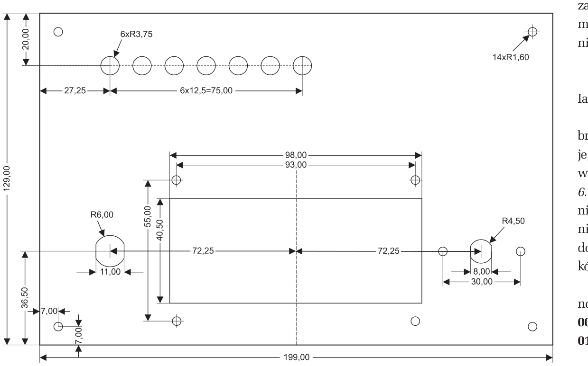

**Fig. 9.** Front-panel drilling for the G1502 enclosure (dimensions in mm).

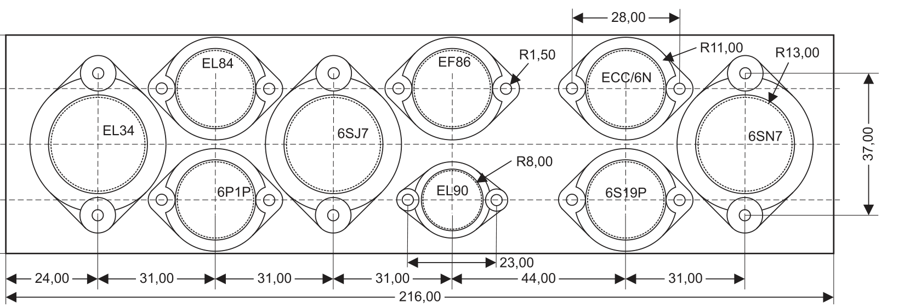

**Fig. 10.** Front-panel drilling for the tube sockets, G1502 enclosure (dimensions in mm).

## Operating instructions (summary)

The complete user manual, including the list of menu options and the tube catalog, was published on
the EP 5/2010 CD (reproduced in full [below](#user-manual-from-the-cd)). Only a summary of the most
important information is given here.

All voltages on the LCD are in volts [V] and currents in milliamperes [mA]. The seconds counter
shows the time remaining until the end of the measurement. The cursor position is indicated by a
blinking character. The cursor is moved around the LCD by turning the **+/–** knob with the
**SET/START** button released. The value under the cursor is changed by turning the **+/–** knob
with **SET/START** held down.

If the cursor is on the tube number, a short press ("click") of **SET/START** starts a measurement
cycle.

The tester has a DB9F connector through which the current LCD contents can be sent to a computer
using a straight-through (extension) cable. Transmission parameters: 9600, n, 8, 1. On power-up the
tester sends the message:

```
Press <ESC> to get LCDs copy
Nr TubeType Uh[V] Ih[mA] -Ug[V] Ua[V] Ia[mA] Ug2[V] Ig2[mA] S[mA/V] R[k] K[V/V]
```

At the end of a measurement cycle, or on receiving the ESC character (27h) from the computer, the
tester sends back the current LCD contents, e.g.:

```
20 6L6G__A13 6.3 910 13.9 255 78.4 250 5.30 0.1 0.0 0.0
```

The tester ignores characters other than ESC, so enabling echo in the terminal program lets you type
your own comments alongside the measurement results.

Selecting the tube number also selects the tester's operating mode:

| Number | Mode |
|---|---|
| **00** | Power supply |
| **01** | Reserved for future use |
| **02…80** | Measurement of tubes from the fixed catalog |
| **81…99** | Editing and measurement of tubes from the user-defined catalog |

### Power-supply mode

In power-supply mode, voltages and currents are set manually. Move the cursor to the chosen field
and, holding **SET/START**, set the desired value with the **+/–** knob. The tester applies the set
value **when the button is released**.

While the button is held, the display shows the **set value** of the selected parameter; when it is
released, the **measured value**.

Moving the cursor to the tube-number field almost immediately zeroes all voltages (the first-grid
voltage is set to –24 V).

### Tube-measurement mode

To measure a tube's basic parameters, set a number in the range **01…99** and click **SET/START**.
The tester gently switches on the heater and, after the defined time, the other voltages needed to
determine the tube's parameters.

A successfully completed measurement is signalled by a **single beep**. The heater stays on, the
anode and grid voltages are switched off, and the results are sent to the serial port and "frozen" on
the LCD.

In this state:

- a long press of **SET/START** brings up the catalog data on the LCD, so you can compare them with
  the measured results;
- turning the **+/–** knob with **SET/START** held changes the electrode system being measured
  (double tubes only);
- clicking **SET/START** restarts the measurement cycle from the beginning.

Any movement of the **+/–** knob with **SET/START** released aborts the measurement and almost
immediately zeroes all voltages (the first-grid voltage is set to –24 V).

### Alarms

The tester signals with a **double beep** an overload of the heater (**H**), anode (**A**) or
second-grid (**G**) circuit, or heatsink overheating (**T**). When an alarm occurs, all voltages are
switched off (the first-grid voltage is set to –24 V) and the display contents are "frozen". The
main cause of the alarm is shown by an indicator. Additional information can be read from the
display, but because of the hardware protections, the last readings may not be reliable.

The alarm — which must be cleared before the tester can be used further — is reset by turning the
**+/–** knob. An overheating alarm can only be cleared after the heatsink has cooled to 70 °C.

### Editing the tube catalog

The names and parameters of tubes numbered **81…99** can be defined by the user. To do so, place the
cursor on the letter or number to be changed, hold **SET/START** and set the desired value with the
knob.

For single tubes, set the electrode-system number to **"0"**. Tubes with a dual electrode system are
entered in two consecutive positions: **"1"** with the lower and **"2"** with the higher catalog
number.

### Adapters for unusual tubes (summary)

The set of test sockets accepts 65 of the 98 tube types in the catalog. The remaining 33 types can be
measured by wiring the tube to the banana jacks. Some tubes, however, require special adapters. These
exceptions include triode-pentodes such as the ECL86 and PCL86, and tuning indicators ("magic eyes")
such as the EM84, EM80 and 6AF6G.

After connecting the tube to the tester via the adapter, select the correct tube type from the
catalog (ECL86, PCL86) and start an automatic measurement. The measured system is changed by
selecting ECL86TJ12 for the triode or ECL86PJ22 for the pentode.

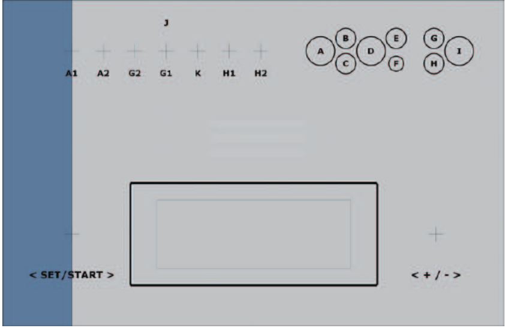

**Fig. 11.** Front-panel sticker, size 199×129 mm.

*Tomasz Gumny, EP — Adam Tatuś*

---

# User manual (from the CD)

## LCD layout

### Power-supply mode

```
                           Operating mode
                              |
           Tube number -- 00 PwrSupply G-24.0V -- Grid 1 voltage [V]
     Heater voltage [V] -- H= 0.0V A=  0 G2=  0 -- Grid 2 voltage [V]
    Heater current [mA] ------ 0mA |0.00   0.00 -- Grid 2 current [mA]
                         *OVERHEA|T W|arning*
                                 |   |       \
                          Anode [V]  Anode    Persistent warning
                                     current [mA]
```

### Tube edit / measurement mode

```
                                  +--- Socket letter [A..J] ........... A: EL34
                                  |+-- Electrode system no. [0 or 1/2]  B: EL84
                      Tube type   ||+- Heating time [1..9] minutes      C: 6P1P
                            |     |||                                   D: 6SJ7
           Tube number -- 01 ECC81_G11 G- 2.0V -- Grid 1 voltage [V]    E: EF86
     Heater voltage [V] -- H=12.6V A=250 G2=  0 -- Grid 2 voltage [V]   F: EL90
    Heater current [mA] ------ 0mA  10.0   0.00 -- Grid 2 current [mA]  G: ECC/6N
 Transconductance[mA/V] -- S= 5.5 R=11.0 K=60.0 -- Gain [V/V]           H: 6S19P
                                 |                                      I: 6SN7
                         Internal resistance [kΩ]                       J: other
```

All voltages on the LCD are in volts [V] and currents in milliamperes [mA].

### Additional information

```
                         00 PwrSupply G-24.0V \
                         H=15.0V A=300 G2=300 -- Max values in power-supply mode
    Alarm indicator -- A 2500mA 190.0 38.00   /
                         * OVERHEAT Wa T= 37s -- Seconds counter [s] during measurement
```

The alarm-indicator position can show the following letters:

- **A**: anode current > 190 mA
- **G**: second-grid current > 38 mA
- **H**: heater current > 3.8 A
- **T**: heatsink temperature > 80 °C

The seconds counter shows the time remaining until the end of the measurement.

The cursor position is indicated by a blinking character. The cursor is moved around the LCD by
turning the **+/–** knob with **SET/START** released. The value under the cursor is changed by
turning the **+/–** knob with **SET/START** held down.

If the cursor is on the tube number, a short press ("click") of **SET/START** starts a measurement
cycle.

The tester has a DB9F connector through which the current LCD contents can be sent to a computer
using an "extension" (straight-through) cable. Transmission parameters:

- 9600 baud
- no parity
- 8 data bits
- 1 stop bit

On power-up the tester sends the following message to the computer:

```
Press <ESC> to get LCDs copy
Nr TubeType Uh[V] Ih[mA] -Ug[V] Ua[V] Ia[mA] Ug2[V] Ig2[mA] S[mA/V] R[k] K[V/V]
```

At the end of a measurement cycle, or on receiving ESC (27h) from the computer, the tester sends
back the current LCD contents, e.g.:

```
20 6L6G__A13 6.3 910 13.9 255 78.4 250 5.30 0.1 0.0 0.0
```

The tester ignores characters other than ESC, so enabling echo in the terminal program lets you add
your own comments to the measurement results.

Selecting the tube number also selects the operating mode:

- **00** — Power supply
- **01** — Reserved for future use
- **02..80** — Measurement of tubes from the fixed catalog
- **81..99** — Editing and measurement of tubes from the user-defined catalog

### Power-supply mode

In power-supply mode, voltages and currents are set manually: move the cursor to the chosen field
and, holding **SET/START**, set the desired value with the **+/–** knob. The tester applies the set
value when the button is released.

While the button is held, the set value of the selected parameter is displayed; after release, the
measured value.

Moving the cursor to the tube-number field almost immediately zeroes all voltages (the first-grid
voltage is set to –24 V).

### Tube-measurement mode

To measure a tube's basic parameters, set a number in the range 01..99 and click **SET/START**. The
tester gently switches on the heater and, after the defined time, the other voltages needed to
determine the tube's parameters.

A successfully completed measurement is signalled by a single beep. The heater stays on, the anode
and grid voltages are switched off, and the results are sent to the serial port and "frozen" on the
LCD.

In this state:

- a long press of **SET/START** shows the catalog data on the LCD for comparison with the results;
- turning the **+/–** knob with **SET/START** held changes the electrode system being measured
  (double tubes only);
- clicking **SET/START** restarts the measurement cycle.

Any movement of the **+/–** knob with **SET/START** released aborts the measurement and almost
immediately zeroes all voltages (the first-grid voltage is set to –24 V).

### Alarms

The tester signals with a double beep an overload of the heater (H), anode (A) or second-grid (G)
circuit, or heatsink overheating (T). After an alarm, all voltages are switched off (first-grid
voltage set to –24 V) and the display contents are "frozen". The main cause of the alarm is shown by
the indicator. Additional information can be read from the display, but because of the hardware
protections the last readings may not be reliable.

The alarm — which must be cleared to continue using the tester — is reset by turning the **+/–**
knob. The overheating alarm can be cleared once the heatsink has cooled to 70 °C.

### Editing the tube catalog

The names and parameters of tubes 81..99 can be defined by the user: place the cursor on the letter
or number to be changed, hold **SET/START** and set the desired value with the knob.

For single tubes, set the electrode-system number to "0". Tubes with a dual electrode system are
entered in two consecutive positions: "1" with the lower and "2" with the higher catalog number.

## Fixed tube catalog (02–80)

Column key: **Type** is the 9-character name shown on the LCD; its last three characters are
**PSC** = socket letter (A…J), electrode-system number (0 = single, 1/2 = first/second half), heating
time in minutes. Uh [V], Ih [mA] (non-zero = current-regulated heater, e.g. P-series), Ug1 [–V],
Ua [V], Ia [mA], Ug2 [V], Ig2 [mA], S [mA/V], R [kΩ], K [V/V]. A value of 0.0 means "not specified";
99.9 is the display maximum.

| No. | Type | Socket | Sys | Heat [min] | Uh [V] | Ih [mA] | –Ug1 [V] | Ua [V] | Ia [mA] | Ug2 [V] | Ig2 [mA] | S [mA/V] | R [kΩ] | K [V/V] |
|---|---|---|---|---|---|---|---|---|---|---|---|---|---|---|
| 02 | `ECC81_G11` | G | 1 | 1 | 12.6 | 0 | 2.0 | 250 | 10.0 | 0 | 0.00 | 5.5 | 11.0 | 60.0 |
| 03 | `ECC81_G21` | G | 2 | 1 | 12.6 | 0 | 2.0 | 250 | 10.0 | 0 | 0.00 | 5.5 | 11.0 | 60.0 |
| 04 | `ECC82_G11` | G | 1 | 1 | 12.6 | 0 | 8.5 | 250 | 10.5 | 0 | 0.00 | 2.2 | 7.7 | 17.0 |
| 05 | `ECC82_G21` | G | 2 | 1 | 12.6 | 0 | 8.5 | 250 | 10.5 | 0 | 0.00 | 2.2 | 7.7 | 17.0 |
| 06 | `ECC83_G11` | G | 1 | 1 | 12.6 | 0 | 2.0 | 250 | 1.2 | 0 | 0.00 | 1.6 | 62.5 | 99.9 |
| 07 | `ECC83_G21` | G | 2 | 1 | 12.6 | 0 | 2.0 | 250 | 1.2 | 0 | 0.00 | 1.6 | 62.5 | 99.9 |
| 08 | `ECC88_G11` | G | 1 | 1 | 6.3 | 0 | 1.3 | 90 | 15.0 | 0 | 0.00 | 12.5 | 2.6 | 33.0 |
| 09 | `ECC88_G21` | G | 2 | 1 | 6.3 | 0 | 1.3 | 90 | 15.0 | 0 | 0.00 | 12.5 | 2.6 | 33.0 |
| 10 | `6N1P__G11` | G | 1 | 1 | 6.3 | 0 | 4.0 | 250 | 7.5 | 0 | 0.00 | 4.5 | 0.0 | 35.0 |
| 11 | `6N1P__G21` | G | 2 | 1 | 6.3 | 0 | 4.0 | 250 | 7.5 | 0 | 0.00 | 4.5 | 0.0 | 35.0 |
| 12 | `6N2P__G11` | G | 1 | 1 | 6.3 | 0 | 1.5 | 250 | 2.3 | 0 | 0.00 | 2.1 | 0.0 | 99.9 |
| 13 | `6N2P__G21` | G | 2 | 1 | 6.3 | 0 | 1.5 | 250 | 2.3 | 0 | 0.00 | 2.1 | 0.0 | 99.9 |
| 14 | `6N6P__G11` | G | 1 | 1 | 6.3 | 0 | 2.0 | 120 | 30.0 | 0 | 0.00 | 11.0 | 1.9 | 20.0 |
| 15 | `6N6P__G21` | G | 2 | 1 | 6.3 | 0 | 2.0 | 120 | 30.0 | 0 | 0.00 | 11.0 | 1.9 | 20.0 |
| 16 | `6N30P_G11` | G | 1 | 1 | 6.3 | 0 | 2.2 | 80 | 40.0 | 0 | 0.00 | 18.0 | 0.0 | 15.0 |
| 17 | `6N30P_G21` | G | 2 | 1 | 6.3 | 0 | 2.2 | 80 | 40.0 | 0 | 0.00 | 18.0 | 0.0 | 15.0 |
| 18 | `6SL7__I12` | I | 1 | 2 | 6.3 | 0 | 2.0 | 250 | 2.3 | 0 | 0.00 | 1.6 | 44.0 | 70.0 |
| 19 | `6SL7__I22` | I | 2 | 2 | 6.3 | 0 | 2.0 | 250 | 2.3 | 0 | 0.00 | 1.6 | 44.0 | 70.0 |
| 20 | `6SN7__I12` | I | 1 | 2 | 6.3 | 0 | 8.0 | 250 | 9.0 | 0 | 0.00 | 2.6 | 7.7 | 20.0 |
| 21 | `6SN7__I22` | I | 2 | 2 | 6.3 | 0 | 8.0 | 250 | 9.0 | 0 | 0.00 | 2.6 | 7.7 | 20.0 |
| 22 | `6AS7__I15` | I | 1 | 5 | 6.3 | 0 | 20.0 | 80 | 110.0 | 0 | 0.00 | 0.0 | 0.0 | 0.0 |
| 23 | `6AS7__I25` | I | 2 | 5 | 6.3 | 0 | 20.0 | 80 | 110.0 | 0 | 0.00 | 0.0 | 0.0 | 0.0 |
| 24 | `6S19S_H02` | H | 0 | 2 | 6.3 | 0 | 15.0 | 90 | 100.0 | 0 | 0.00 | 0.0 | 0.0 | 0.0 |
| 25 | `EF86__E01` | E | 0 | 1 | 6.3 | 0 | 2.0 | 250 | 3.0 | 140 | 0.60 | 1.9 | 99.9 | 38.0 |
| 26 | `6SJ7__D02` | D | 0 | 2 | 6.3 | 0 | 3.0 | 250 | 3.0 | 100 | 0.80 | 1.7 | 99.9 | 0.0 |
| 27 | `EL84__B02` | B | 0 | 2 | 6.3 | 0 | 7.3 | 250 | 48.0 | 250 | 5.50 | 11.3 | 40.0 | 19.0 |
| 28 | `6V6S__A02` | A | 0 | 2 | 6.3 | 0 | 12.5 | 250 | 45.0 | 250 | 5.00 | 3.8 | 50.0 | 0.0 |
| 29 | `6L6G__A03` | A | 0 | 3 | 6.3 | 0 | 14.0 | 250 | 72.0 | 250 | 5.00 | 0.0 | 22.5 | 0.0 |
| 30 | `EL34__A05` | A | 0 | 5 | 6.3 | 0 | 13.5 | 250 | 100.0 | 265 | 14.90 | 11.0 | 15.0 | 11.0 |
| 31 | `KT66__A05` | A | 0 | 5 | 6.3 | 0 | 15.0 | 250 | 85.0 | 250 | 7.00 | 6.0 | 22.5 | 0.0 |
| 32 | `KT77__A05` | A | 0 | 5 | 6.3 | 0 | 15.0 | 250 | 100.0 | 250 | 10.00 | 10.5 | 23.0 | 11.5 |
| 33 | `KT88__A05` | A | 0 | 5 | 6.3 | 0 | 15.0 | 250 | 140.0 | 250 | 7.00 | 11.5 | 12.0 | 8.0 |
| 34 | `6P1P__C02` | C | 0 | 2 | 6.3 | 0 | 12.5 | 250 | 45.0 | 250 | 7.00 | 4.5 | 50.0 | 0.0 |
| 35 | `6L6___A03` | A | 0 | 3 | 6.3 | 0 | 14.0 | 250 | 72.0 | 250 | 8.00 | 6.0 | 30.0 | 0.0 |
| 36 | `EL90__F01` | F | 0 | 1 | 6.3 | 0 | 12.5 | 250 | 45.0 | 250 | 4.50 | 4.1 | 52.0 | 0.0 |
| 37 | `EL95__F01` | F | 0 | 1 | 6.3 | 0 | 9.0 | 250 | 24.0 | 250 | 4.50 | 5.0 | 80.0 | 17.0 |
| 38 | `PCL86TJ12` | J | 1 | 2 | 0.0 | 300 | 1.7 | 230 | 1.2 | 0 | 0.00 | 1.6 | 62.0 | 99.0 |
| 39 | `PCL86PJ22` | J | 2 | 2 | 0.0 | 300 | 5.7 | 230 | 39.0 | 230 | 6.50 | 10.5 | 45.0 | 99.9 |
| 40 | `ECL86TJ12` | J | 1 | 2 | 6.3 | 0 | 1.9 | 250 | 1.2 | 0 | 0.00 | 1.6 | 62.0 | 99.0 |
| 41 | `ECL86PJ22` | J | 2 | 2 | 6.3 | 0 | 7.0 | 250 | 36.0 | 250 | 6.00 | 10.0 | 48.0 | 99.9 |
| 42 | `ECL82TJ12` | J | 1 | 2 | 6.3 | 0 | 0.5 | 100 | 3.5 | 0 | 0.00 | 2.2 | 0.0 | 70.0 |
| 43 | `ECL82PJ22` | J | 2 | 2 | 6.3 | 0 | 11.5 | 170 | 41.0 | 170 | 6.50 | 7.5 | 16.0 | 9.5 |
| 44 | `ECC35_I12` | I | 1 | 2 | 6.3 | 0 | 2.3 | 250 | 2.3 | 0 | 0.00 | 2.0 | 0.0 | 0.0 |
| 45 | `ECC35_I22` | I | 2 | 2 | 6.3 | 0 | 2.3 | 250 | 2.3 | 0 | 0.00 | 2.0 | 0.0 | 0.0 |
| 46 | `ECC40_J12` | J | 1 | 2 | 6.3 | 0 | 5.2 | 250 | 6.0 | 0 | 0.00 | 2.7 | 0.0 | 0.0 |
| 47 | `ECC40_J22` | J | 2 | 2 | 6.3 | 0 | 5.2 | 250 | 6.0 | 0 | 0.00 | 2.7 | 0.0 | 0.0 |
| 48 | `ECC85_G11` | G | 1 | 1 | 6.3 | 0 | 2.3 | 250 | 10.0 | 0 | 0.00 | 5.9 | 0.0 | 0.0 |
| 49 | `ECC85_G21` | G | 2 | 1 | 6.3 | 0 | 2.3 | 250 | 10.0 | 0 | 0.00 | 5.9 | 0.0 | 0.0 |
| 50 | `ECC91_J12` | J | 1 | 2 | 6.3 | 0 | 0.9 | 100 | 8.5 | 0 | 0.00 | 5.3 | 0.0 | 0.0 |
| 51 | `ECC91_J22` | J | 2 | 2 | 6.3 | 0 | 0.9 | 100 | 8.5 | 0 | 0.00 | 5.3 | 0.0 | 0.0 |
| 52 | `ECC99_G12` | G | 1 | 2 | 12.6 | 0 | 4.0 | 150 | 18.0 | 0 | 0.00 | 9.5 | 2.3 | 22.0 |
| 53 | `ECC99_G22` | G | 2 | 2 | 12.6 | 0 | 4.0 | 150 | 18.0 | 0 | 0.00 | 9.5 | 2.3 | 22.0 |
| 54 | `E180CCG12` | G | 1 | 2 | 12.6 | 0 | 1.9 | 150 | 8.5 | 0 | 0.00 | 6.4 | 7.2 | 46.0 |
| 55 | `E180CCG22` | G | 2 | 2 | 12.6 | 0 | 1.9 | 150 | 8.5 | 0 | 0.00 | 6.4 | 7.2 | 46.0 |
| 56 | `E182CCJ12` | J | 1 | 2 | 12.6 | 0 | 2.0 | 100 | 36.0 | 0 | 0.00 | 15.0 | 0.0 | 24.0 |
| 57 | `E182CCJ22` | J | 2 | 2 | 12.6 | 0 | 2.0 | 100 | 36.0 | 0 | 0.00 | 15.0 | 0.0 | 24.0 |
| 58 | `ECC801G11` | G | 1 | 1 | 12.6 | 0 | 2.0 | 250 | 10.0 | 0 | 0.00 | 5.5 | 0.0 | 0.0 |
| 59 | `ECC801G21` | G | 2 | 1 | 12.6 | 0 | 2.0 | 250 | 10.0 | 0 | 0.00 | 5.5 | 0.0 | 0.0 |
| 60 | `ECC802G11` | G | 1 | 1 | 12.6 | 0 | 8.5 | 250 | 10.5 | 0 | 0.00 | 2.2 | 7.7 | 17.0 |
| 61 | `ECC802G21` | G | 2 | 1 | 12.6 | 0 | 8.5 | 250 | 10.5 | 0 | 0.00 | 2.2 | 7.7 | 17.0 |
| 62 | `ECC803G11` | G | 1 | 1 | 12.6 | 0 | 2.0 | 250 | 1.2 | 0 | 0.00 | 1.6 | 62.5 | 99.9 |
| 63 | `ECC803G21` | G | 2 | 1 | 12.6 | 0 | 2.0 | 250 | 1.2 | 0 | 0.00 | 1.6 | 62.5 | 99.9 |
| 64 | `ECC832G11` | G | 1 | 1 | 12.6 | 0 | 8.5 | 250 | 10.5 | 0 | 0.00 | 2.2 | 7.7 | 17.0 |
| 65 | `ECC832G21` | G | 2 | 1 | 12.6 | 0 | 2.0 | 250 | 1.2 | 0 | 0.00 | 1.6 | 62.5 | 99.9 |
| 66 | `PCC84_G11` | G | 1 | 1 | 0.0 | 300 | 1.5 | 90 | 12.0 | 0 | 0.00 | 6.0 | 0.0 | 0.0 |
| 67 | `PCC84_G21` | G | 2 | 1 | 0.0 | 300 | 1.5 | 90 | 12.0 | 0 | 0.00 | 6.0 | 0.0 | 0.0 |
| 68 | `PCC85_G11` | G | 1 | 1 | 0.0 | 300 | 2.1 | 200 | 10.0 | 0 | 0.00 | 5.8 | 0.0 | 0.0 |
| 69 | `PCC85_G21` | G | 2 | 1 | 0.0 | 300 | 2.1 | 200 | 10.0 | 0 | 0.00 | 5.8 | 0.0 | 0.0 |
| 70 | `PCC88_G11` | G | 1 | 1 | 0.0 | 300 | 1.2 | 90 | 15.0 | 0 | 0.00 | 12.5 | 0.0 | 0.0 |
| 71 | `PCC88_G21` | G | 2 | 1 | 0.0 | 300 | 1.2 | 90 | 15.0 | 0 | 0.00 | 12.5 | 0.0 | 0.0 |
| 72 | `6SC7__J12` | J | 1 | 2 | 6.3 | 0 | 2.0 | 250 | 2.0 | 0 | 0.00 | 1.3 | 0.0 | 0.0 |
| 73 | `6SC7__J22` | J | 2 | 2 | 6.3 | 0 | 2.0 | 250 | 2.0 | 0 | 0.00 | 1.3 | 0.0 | 0.0 |
| 74 | `6N3P__J11` | J | 1 | 1 | 6.3 | 0 | 2.0 | 150 | 8.2 | 0 | 0.00 | 5.6 | 0.0 | 0.0 |
| 75 | `6N3P__J21` | J | 2 | 1 | 6.3 | 0 | 2.0 | 150 | 8.2 | 0 | 0.00 | 5.6 | 0.0 | 0.0 |
| 76 | `6N5S__I13` | I | 1 | 3 | 6.3 | 0 | 20.0 | 90 | 120.0 | 0 | 0.00 | 0.0 | 0.0 | 0.0 |
| 77 | `6N5S__I23` | I | 2 | 3 | 6.3 | 0 | 20.0 | 90 | 120.0 | 0 | 0.00 | 0.0 | 0.0 | 0.0 |
| 78 | `6N7S__J13` | J | 1 | 3 | 6.3 | 0 | 6.0 | 290 | 3.5 | 0 | 0.00 | 1.6 | 0.0 | 0.0 |
| 79 | `6N7S__J23` | J | 2 | 3 | 6.3 | 0 | 6.0 | 290 | 3.5 | 0 | 0.00 | 1.6 | 0.0 | 0.0 |
| 80 | `6S2S__A02` | A | 0 | 2 | 6.3 | 0 | 8.0 | 250 | 9.0 | 0 | 0.00 | 2.5 | 0.0 | 0.0 |

## User-defined tube catalog (81–99)

Default contents of the editable (EEPROM) part of the catalog. Columns as above.

| No. | Type | Socket | Sys | Heat [min] | Uh [V] | Ih [mA] | –Ug1 [V] | Ua [V] | Ia [mA] | Ug2 [V] | Ig2 [mA] | S [mA/V] | R [kΩ] | K [V/V] |
|---|---|---|---|---|---|---|---|---|---|---|---|---|---|---|
| 81 | `6N15S_J11` | J | 1 | 1 | 6.3 | 0 | 9.0 | 100 | 9.0 | 0 | 0.00 | 5.6 | 0.0 | 0.0 |
| 82 | `6N15S_J21` | J | 2 | 1 | 6.3 | 0 | 9.0 | 100 | 9.0 | 0 | 0.00 | 5.6 | 0.0 | 0.0 |
| 83 | `EBL21_J02` | J | 0 | 2 | 6.3 | 0 | 6.0 | 250 | 36.0 | 250 | 4.50 | 9.0 | 50.0 | 23.0 |
| 84 | `EF21__J02` | J | 0 | 2 | 6.3 | 0 | 2.0 | 250 | 6.0 | 250 | 2.00 | 4.5 | 99.9 | 0.0 |
| 85 | `EF806_E01` | E | 0 | 1 | 6.3 | 0 | 2.2 | 250 | 3.0 | 140 | 0.60 | 2.2 | 99.9 | 38.0 |
| 86 | `EF80__J01` | J | 0 | 1 | 6.3 | 0 | 2.0 | 175 | 10.0 | 175 | 0.00 | 7.2 | 0.0 | 0.0 |
| 87 | `EF85__J01` | J | 0 | 1 | 6.3 | 0 | 2.0 | 250 | 10.0 | 100 | 2.50 | 6.0 | 99.9 | 26.0 |
| 88 | `EF89__J01` | J | 0 | 1 | 6.3 | 0 | 2.0 | 250 | 9.0 | 100 | 3.00 | 3.6 | 99.9 | 0.0 |
| 89 | `7027__J05` | J | 0 | 5 | 6.3 | 0 | 14.0 | 250 | 72.0 | 250 | 5.00 | 0.0 | 22.5 | 0.0 |
| 90 | `7581__A05` | A | 0 | 5 | 6.3 | 0 | 14.0 | 250 | 72.0 | 250 | 5.00 | 6.0 | 22.5 | 0.0 |
| 91 | `7591__J05` | J | 0 | 5 | 6.3 | 0 | 10.0 | 290 | 60.0 | 290 | 8.00 | 10.2 | 29.0 | 16.8 |
| 92 | `EL36__J05` | J | 0 | 5 | 6.3 | 0 | 8.2 | 100 | 100.0 | 100 | 7.00 | 14.0 | 5.0 | 5.6 |
| 93 | `6J7___J02` | J | 0 | 2 | 6.3 | 0 | 3.0 | 250 | 2.0 | 100 | 0.50 | 1.2 | 0.0 | 0.0 |
| 94 | `EL82__B02` | B | 0 | 2 | 6.3 | 0 | 10.4 | 170 | 53.0 | 170 | 10.00 | 9.0 | 20.0 | 10.0 |
| 95 | `EL86 _B02` | B | 0 | 2 | 6.3 | 0 | 12.5 | 170 | 70.0 | 170 | 5.00 | 10.0 | 23.0 | 8.0 |
| 96 | `6P15P_J02` | J | 0 | 2 | 6.3 | 0 | 3.5 | 280 | 31.0 | 170 | 5.00 | 15.0 | 99.9 | 7.0 |
| 97 | `6Z4P__J02` | J | 0 | 2 | 6.3 | 0 | 1.0 | 250 | 10.8 | 150 | 4.30 | 5.2 | 99.9 | 41.0 |
| 98 | `6P7S__J03` | J | 0 | 3 | 6.3 | 0 | 14.0 | 250 | 72.0 | 250 | 8.00 | 5.9 | 99.9 | 8.5 |
| 99 | `6P9___J02` | J | 0 | 2 | 6.3 | 0 | 6.0 | 250 | 30.0 | 250 | 3.00 | 7.0 | 60.0 | 0.0 |

## Adapters for unusual tubes

The set of test sockets accepts 65 of the 98 tube types in the catalog. The remaining 33 types can be
measured by wiring the tube to the banana jacks. Some tubes, however, require dedicated adapters.
These exceptions include triode-pentodes such as the ECL86 and PCL86, and tuning indicators ("magic
eyes") such as the EM84, EM80 and 6AF6G.

### ECL86 / PCL86 adapter

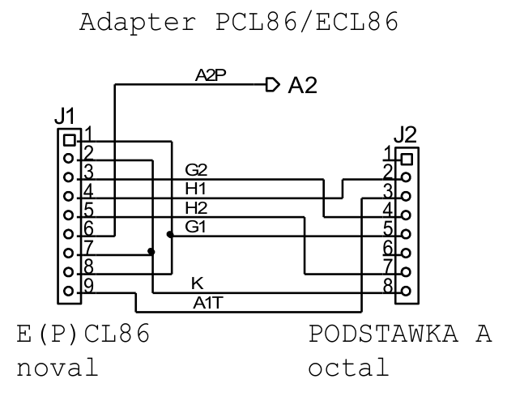

**Fig. 12.** ECL86/PCL86 adapter schematic (J1: E(P)CL86 noval socket; J2: plug into octal socket A;
the pentode anode A2P goes to banana jack A2).

After connecting the tube to the tester via the adapter, select the correct tube type from the
catalog (ECL86, PCL86) and start an automatic measurement. The measured system is changed by
selecting ECL86TJ12 for the triode or ECL86PJ22 for the pentode.

### EM84 / EM87 magic-eye adapter

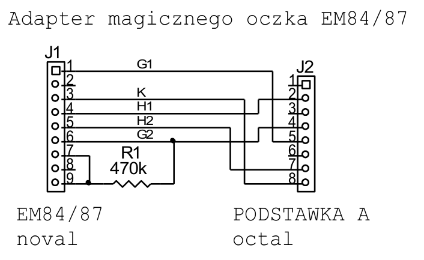

**Fig. 13.** EM84 adapter schematic (J1: EM84/87 noval socket; J2: plug into octal socket A).

This adapter allows testing EM84 and EM87 tubes. Magic eyes are measured in **power-supply mode**;
only in this mode can Ug1 be changed manually, which is needed to watch the bars deflect.

- Set the heater voltage H to 6.3 V.
- The tube's anode is connected to the second-grid supply G2, which can deliver enough current. Set
  G2 to 250 V.
- Varying G1 over 0…–24 V (EM84) or 0…–10 V (EM87) changes the height of the bars on the screen.

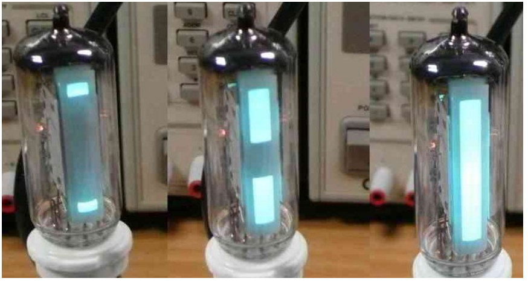

**Fig. 14.** EM84 magic eye during measurement.

### EM80 magic-eye adapter

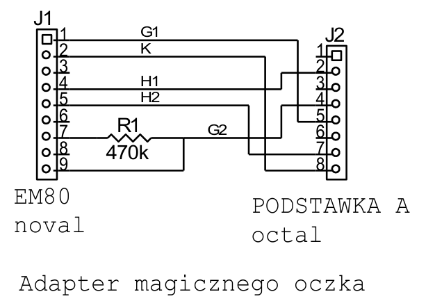

**Fig. 15.** EM80 adapter schematic (J1: EM80 noval socket; J2: plug into octal socket A).

This adapter allows testing EM80 tubes and equivalents. Magic eyes are measured in power-supply mode;
only in this mode can Ug1 be changed manually, which is needed to watch the shadow deflect.

- Set the heater voltage H to 6.3 V.
- The tube's anode is connected to the second-grid supply G2, which can deliver enough current. Set
  G2 to 250 V.
- Varying G1 over –1…–14 V changes the fill angle of the screen.

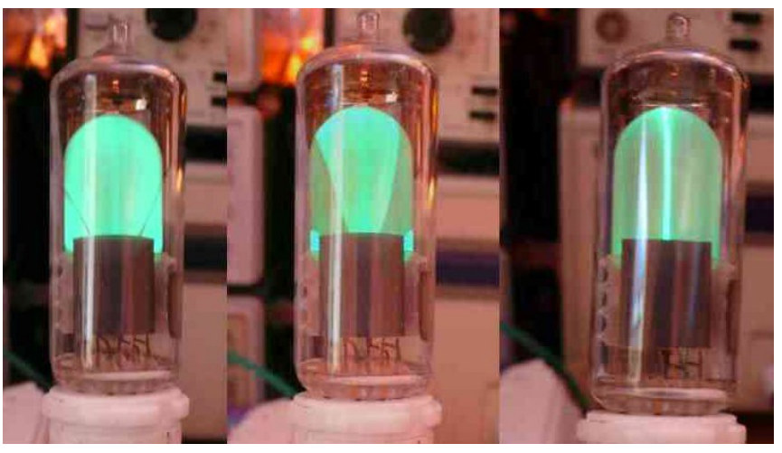

**Fig. 16.** EM80 magic eye during measurement *(the original caption says "EM84" — a copy-paste
error in the source)*.

### 6AF6G magic-eye adapter

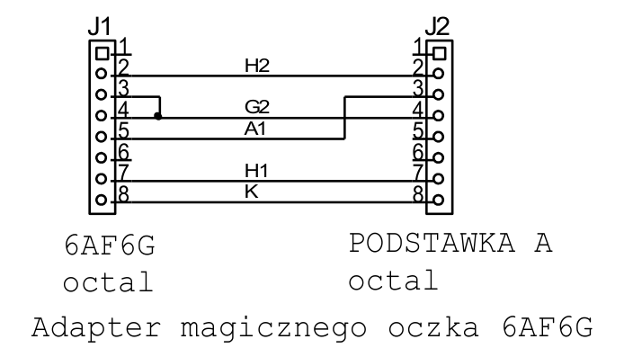

**Fig. 17.** 6AF6G adapter schematic (J1: 6AF6G octal socket; J2: plug into octal socket A).

Measuring 6AF6G-type eyes:

- Set the heater voltage H to 6.3 V.
- Set the anode voltage A to 125 V or 250 V.
- Varying the **G2(!)** control voltage over 0…80 V (A = 125 V) or 0…160 V (A = 250 V) changes the
  width of the shadows on the screen.

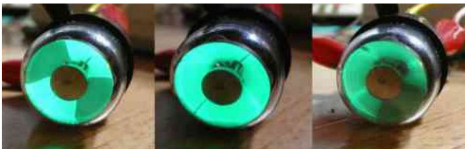

**Fig. 18.** 6AF6G magic eye during measurement *(the original caption says "EM84")*.

These are examples of tubes that need more than plain wires to connect. Nothing prevents you from
designing adapters for measuring other unusual tubes.
